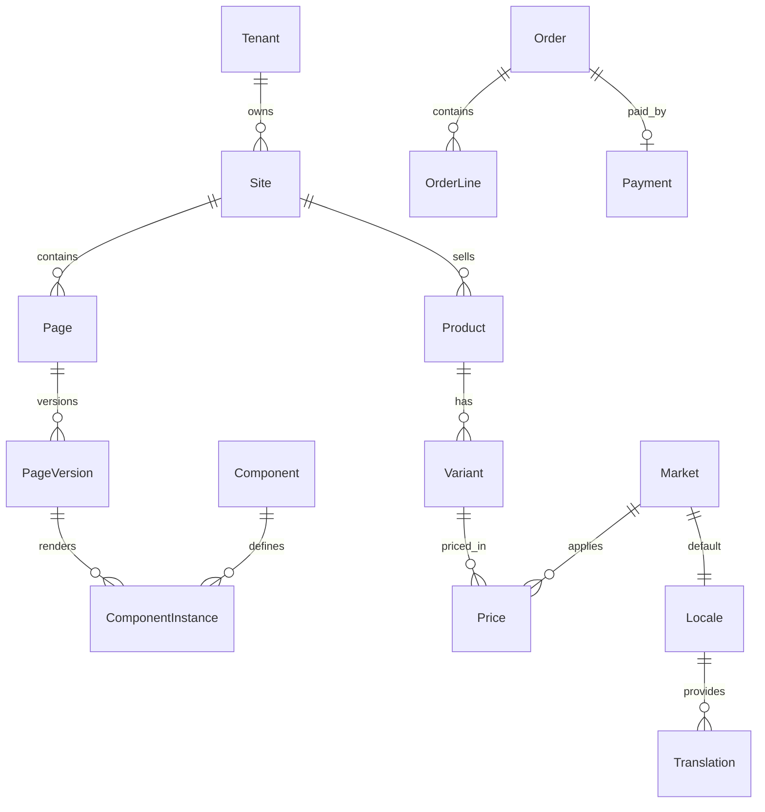
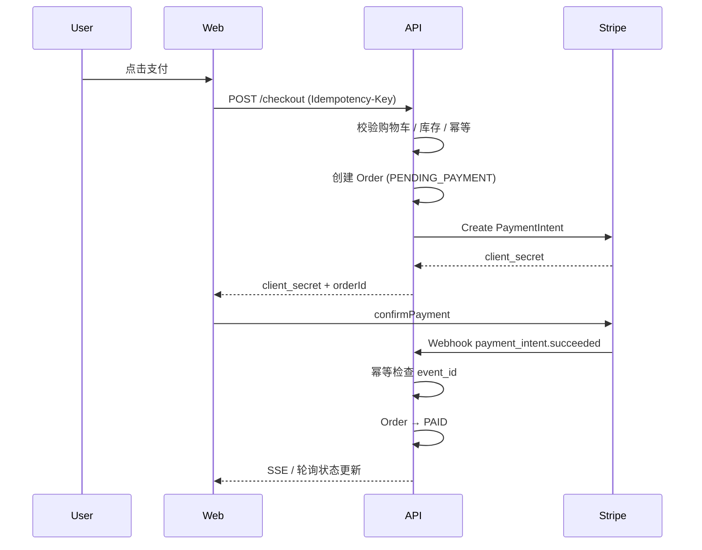

# 独立站设计与建站平台开发设计文档

| 属性 | 说明 |
|------|------|
| 文档版本 | v1.4 |
| 状态 | 设计稿 |
| 目标读者 | 产品、设计、前后端、DevOps |
| 适用范围 | 独立站建站平台 MVP → 多品牌长期运营 |

---

## 0. 当前决策记录

| 决策项 | 结论 | 对文档影响 |
|------|------|----------|
| MVP 范围 | 建站优先 | Phase 1 只交付页面管理、Page Builder、预览、发布、媒体、SEO 和生产部署 |
| 首期市场 | 海外英语 / 美元 | MVP 默认 Market 为 US，Locale 为 en-US，Currency 为 USD |
| 生产部署 | Vercel + Cloudflare R2 优先 | 前台 `apps/web` 部署到 Vercel，媒体进入 R2，API / DB / Redis 独立部署并保留扩展空间 |
| API 部署 | 独立 Node.js 服务 | API 与 Vercel 前台解耦，方便后续接入 Webhook、队列和支付流程 |
| 电商策略 | MVP 做接口级预留，不实现完整交易闭环 | 保留 Commerce 数据模型、基础 API、Webhook 与环境变量位，Phase 2 可直接接入 Stripe |
| 多语言策略 | MVP 做接口级预留 | 默认 `us / en-US / USD` 可用，Market / Locale / Translation API 先落地，非默认语言发布由 Feature Flag 控制 |
| Page Builder | 高还原受控编辑 | 核心区块按设计稿达到约 95% 还原，Desktop / Mobile 独立配置 |
| Figma 导入 | Phase 3 完整导入 | MVP 不做一键导入，但保留命名规范、Token 和 Schema 兼容性 |
| MVP 页面范围 | Landing + 基础页 | 支持首页 / 活动页、隐私政策、服务条款、404，不开放商品交易页 |
| MVP 核心组件 | 营销核心 6 组件 | Hero、RichText、ImageGallery、CTA、FAQ、SpecTable |
| 设计来源 | Figma 或其他设计稿 | 以已有设计稿为还原基准，需提供 Desktop / Mobile 参考 |
| 长期产品目标 | Shopify 级自营建站与电商平台 | 不做 Shopify 兼容或复制，按能力域逐步达到同等级稳定性、可扩展性和运营完整度 |
| 长期工程基线 | 分阶段平台化治理 | 以领域边界、Theme System、API 合约、迁移兼容、测试发布运维作为长期项目准入标准 |

---

## 1. 项目目标

建设一个支持高还原度设计、后台可视化管理、多语言、多市场、电商可接入、数据分析的独立站建站平台。MVP 阶段优先完成“建站 → 预览 → 发布 → 生产部署”的闭环，电商交易能力作为 Phase 2 接入。

长期目标是达到 **Shopify 级自营建站与电商平台能力**：商家/运营人员可以独立完成主题搭建、内容管理、商品与订单运营、多市场发布、支付结账、数据分析和扩展集成。这里的“Shopify 级”指能力完整度、稳定性、可扩展性和运营效率达到同类成熟平台水平，不代表兼容 Shopify API、复制 Shopify 后台或复刻其商业生态。

### 1.1 核心目标

- Figma 设计稿高还原转换为网站页面
- 支持 Desktop / Mobile 独立设计（非单纯响应式缩放）
- 后台 Page Builder 可视化管理页面
- 支持多语言、多地区、多货币
- 支持商品、电商、订单、支付的后续接入架构
- 集成 GA4、GTM、Microsoft Clarity
- 支持版本管理、发布管理、灰度与回滚
- 支持后续扩展多个品牌和站点（多租户）

### 1.2 非目标（MVP 阶段不做）

- 自建 WYSIWYG 全功能设计工具（优先 Figma + Page Builder 组合）
- 多商户 Marketplace（仅支持平台自营多品牌）
- 复杂 ERP / WMS 深度集成（预留 Webhook 扩展点）
- 原生 App（仅 Web，PWA 可选）
- 完整购物车 / 结账 / 支付 / 订单履约闭环（MVP 仅完成接入前置设计与部署位）
- Shopify API / Theme / App Store 兼容层（长期只做自有能力体系，不做第三方平台克隆）

### 1.3 成功指标

| 指标 | 目标 |
|------|------|
| Figma → 页面上线 | ≤ 2 小时（标准 Landing Page） |
| MVP 核心区块还原度 | Hero / RichText / ImageGallery / CTA / FAQ / SpecTable 对设计稿达到约 95% 视觉还原 |
| Phase 3 设计稿还原度 | 关键页面视觉差异 ≤ 5px / 色差 ΔE ≤ 3 |
| 页面 LCP（生产） | ≤ 2.5s（P75，4G） |
| 电商接入准备度（MVP） | Stripe / Webhook / 环境变量 / 数据表结构预留完成 |
| 支付成功率（Phase 2） | ≥ 99%（排除用户主动取消） |
| 发布回滚 | ≤ 5 分钟 |
| Shopify 级长期能力 | 主题系统、Checkout、多市场、多语言、应用扩展、Webhook、API、运维安全均达到生产可规模化标准 |

---

## 2. 总体系统架构

### 2.1 逻辑架构

```
                    Figma
                      |
              Figma Plugin API
                      |
              Layer Parser / Schema Generator
                      |
                 Page Schema (JSON)
                      |
        +-------------+-------------+
        |                           |
   Admin Builder              Website (Next.js)
   (React + Vite)             (SSR / ISR / SSG)
        |                           |
        +-------------+-------------+
                      |
              Backend API (NestJS)
                      |
        +-------------+-------------+
        |             |             |
   PostgreSQL      Redis        Cloudflare R2
        |                           |
        +-------------+-------------+
                      |
              Analytics Pipeline
                      |
             GTM / GA4 / Clarity / Ads
```

### 2.2 部署拓扑

MVP 生产部署采用 **Vercel + Cloudflare R2** 作为首选路径：前台站点由 Vercel 托管并负责 ISR，Admin 以静态站点方式部署，媒体资源存储在 Cloudflare R2。API、PostgreSQL、Redis 独立部署，保证 Phase 2 接入电商和支付时无需重构部署边界。

```
                    Cloudflare CDN
                          |
            +-------------+-------------+
            |                           |
        Next.js (Vercel)          Admin SPA (静态)
            |                           |
            +-------------+-------------+
                          |
                   API Gateway / LB
                          |
            +-------------+-------------+
            |             |             |
       NestJS API      Redis Cluster   R2 (Media)
            |
       PostgreSQL (Primary + Replica)
```

### 2.3 Monorepo 目录结构（建议）

```
app-starter/
├── apps/
│   ├── web/                 # Next.js 前台站点
│   ├── admin/               # React 后台
│   └── figma-plugin/        # Figma 插件
├── packages/
│   ├── schema/              # Page Schema 类型与校验 (Zod / JSON Schema)
│   ├── renderer/            # 共享 React 渲染器
│   ├── design-tokens/       # Design Token 定义
│   ├── analytics/           # 埋点 SDK
│   ├── ui/                  # 前台站点渲染组件（Tailwind，非 Ant Design）
│   └── admin-theme/         # Ant Design 主题 Token 与 ConfigProvider 配置
├── services/
│   └── api/                 # NestJS 后端
├── infra/                   # Terraform / Docker / CI
└── docs/
```

### 2.4 数据流概览

| 场景 | 数据流 |
|------|--------|
| 设计导入 | Figma Plugin → Schema API → `page_versions` (draft) |
| 页面编辑 | Admin Builder → PATCH Schema → 自动保存 → Preview |
| 发布 | Draft → Review → Publish → 写入 Production Snapshot → ISR Revalidate |
| 电商接入（Phase 2） | Web → Cart API → Checkout → Stripe → Webhook → Order PAID |
| 分析 | Component Event → dataLayer → GTM → GA4 / Clarity |

---

## 3. 技术架构

### 3.1 前端网站

**技术栈：**

- Next.js 15（App Router）
- React 19
- TypeScript
- Tailwind CSS
- Framer Motion（动效）
- next-intl（国际化）

**职责：**

- SEO 页面渲染（SSR / ISR / SSG 按页面类型选择）
- Page Schema 解析与组件渲染
- 商品展示、购物车、结账流程
- 多语言、多货币、多市场路由
- 客户端 Analytics 事件上报

**渲染策略：**

| 页面类型 | 策略 | 原因 |
|----------|------|------|
| 营销 Landing | ISR（revalidate: 60s） | 高频更新、需 SEO |
| 商品详情 | ISR + On-demand Revalidate | 库存/价格变更触发 |
| 结账 / 账户 | SSR（no-store） | 个性化、安全 |
| 静态政策页 | SSG | 极少变更 |

---

### 3.2 后台系统

**技术栈：**

- React + TypeScript
- Vite
- [Ant Design](https://ant.design/)（`antd` ^6.x，后台 UI 唯一组件库）
- `@ant-design/icons`（图标）
- Zustand（编辑器本地状态）
- TanStack Query（服务端状态）
- React Router

**UI 原则：**

- 后台全部界面、表单、表格、弹窗统一使用 Ant Design，不自建基础 UI 组件
- 通过 `ConfigProvider` + Design Token 定制主题色、圆角、字体，与平台品牌保持一致
- 前台站点（`apps/web`）不使用 Ant Design，沿用 Tailwind + 自定义 Renderer 组件以保证 Figma 高还原

**功能模块：**

- Page Builder（可视化编辑）
- 页面 / 版本 / 发布管理
- Design System 与组件库管理
- 媒体库（R2 上传）
- 商品 / 变体 / 定价
- 订单 / 支付 / 退款
- 多市场 / 翻译管理
- Analytics 配置
- 用户与权限

---

### 3.3 页面编辑器

**MVP 编辑边界：**

- 根据设计稿搭建页面，核心区块达到约 95% 视觉还原
- Desktop / Mobile 使用独立布局配置，允许不同尺寸、间距、字体、图片和区块顺序
- 不在 MVP 自建完整 Figma 式自由设计工具，所有可编辑项必须来自受控组件 Props、Layout 和 Design Token
- 完整 Figma Plugin 自动导入放在 Phase 3，MVP 通过人工选择组件和配置属性完成页面搭建

**技术栈：**

- 同构 DOM Renderer + iframe Preview（MVP 主渲染方式）
- React Konva / Overlay（对齐辅助线、差异检查、有限画布微调，可按需要引入）
- dnd-kit（区块拖拽排序）
- Zustand（Undo/Redo 栈）
- Ant Design `Form` / `Input` / `Select` 等（右侧属性面板）

**目标体验：**

类似 Shopify Theme Editor + Figma 对齐辅助的高还原区块编辑能力：运营人员通过区块、属性面板和桌面/手机切换完成页面搭建，设计师可用预览和差异检查确认还原度。

**支持能力：**

- Layer 树形结构编辑
- 坐标 / 尺寸调整（Desktop / Mobile 独立画布）
- 拖拽排序、对齐辅助线
- 组件属性面板（Props Editor）
- 样式属性受 Design Token 约束，允许必要的设计稿覆盖值
- 实时 Preview（iframe 或同构 Renderer）
- Undo / Redo（Command 模式，最多 50 步）
- Desktop / Mobile 切换与独立 Schema 编辑

**编辑器状态模型：**

```typescript
interface EditorState {
  pageId: string;
  versionId: string;
  viewport: 'desktop' | 'mobile';
  selectedNodeId: string | null;
  schema: PageSchema;
  history: { past: PageSchema[]; future: PageSchema[] };
  isDirty: boolean;
}
```

---

### 3.4 后端

**技术栈：**

- NestJS
- PostgreSQL 16
- Redis 7（缓存 / 会话 / 队列）
- BullMQ（异步任务：Webhook、邮件、ISR 触发）
- Prisma ORM

**职责：**

- REST API（Admin + Public）
- 身份认证与 RBAC 权限
- Page Schema CRUD 与版本管理
- 商品 / 订单 / 支付
- Webhook 接收与幂等处理
- 发布快照与缓存失效
- 媒体签名上传 URL 生成

---

### 3.5 UI 组件库规范（Ant Design）

后台系统统一采用 [Ant Design](https://ant.design/) 作为 UI 组件库。Ant Design 提供企业级 React 组件、Design Token 主题算法与 CSS-in-JS 动态主题能力，适合快速构建一致的后台管理界面。

#### 3.5.1 依赖与版本

```json
{
  "antd": "^6.0.0",
  "@ant-design/icons": "^6.0.0"
}
```

#### 3.5.2 主题配置

通过 `ConfigProvider` 注入主题，与平台 Design Token 对齐：

```typescript
import { ConfigProvider, theme } from 'antd';

<ConfigProvider
  theme={{
    token: {
      colorPrimary: '#1677FF',
      borderRadius: 6,
      fontFamily: 'Inter, -apple-system, sans-serif',
    },
    algorithm: theme.defaultAlgorithm, // 支持 theme.darkAlgorithm 切换暗色
  }}
>
  <App />
</ConfigProvider>
```

- 主题配置集中维护于 `packages/admin-theme`
- 支持亮色 / 暗色模式切换（用户偏好存入 localStorage）
- 禁止在业务组件内硬编码 Ant Design 色值，统一引用 Token

#### 3.5.3 布局规范

| 区域 | Ant Design 组件 | 说明 |
|------|-----------------|------|
| 整体框架 | `Layout` + `Sider` + `Header` + `Content` | 左侧导航 + 顶栏 + 内容区 |
| 导航菜单 | `Menu` | 按后台模块分组，支持折叠 |
| 面包屑 | `Breadcrumb` | 页面层级导航 |
| 页头操作 | `Space` + `Button` | 新建、发布等主操作 |

#### 3.5.4 模块组件映射

| 后台模块 | 主要 Ant Design 组件 |
|----------|---------------------|
| 页面列表 | `Table`、`Tag`、`Dropdown`、`Button` |
| Page Builder 属性面板 | `Form`、`Input`、`Select`、`ColorPicker`、`Upload` |
| 媒体库 | `Upload.Dragger`、`Image`、`Modal` |
| 商品管理 | `Table`、`Form`、`InputNumber`、`TreeSelect` |
| 订单管理 | `Table`、`Descriptions`、`Steps`、`Badge` |
| 翻译管理 | `Table`、`Input`、`Tabs` |
| 用户权限 | `Table`、`Transfer`、`Tree` |
| 系统设置 | `Form`、`Switch`、`Select` |
| 全局反馈 | `message`、`notification`、`Modal.confirm` |
| 加载状态 | `Spin`、`Skeleton` |

#### 3.5.5 表单与表格约定

- 表单统一使用 `Form` + `Form.Item`，布局采用 `layout="vertical"`（复杂表单可用 `horizontal`）
- 列表页统一 `Table` + 分页（`pagination`），支持排序 / 筛选 / 列设置
- 删除等危险操作使用 `Modal.confirm` 二次确认
- 文件上传使用 `Upload` 组件，配合 R2 Presigned URL 直传
- 日期时间统一 `DatePicker` / `RangePicker`，格式 ISO 8601 存储

#### 3.5.6 国际化

- Ant Design 组件文案通过 `ConfigProvider locale` 切换（`zh_CN` / `en_US` 等）
- 与后台 i18n 框架（`react-i18next`）联动，Locale 变更时同步更新 `antd` locale 对象

#### 3.5.7 与前台 Design System 的边界

| 层面 | 技术 | 用途 |
|------|------|------|
| 后台 Admin UI | Ant Design | 管理界面、编辑器属性面板 |
| 前台 Website | Tailwind + `packages/ui` | Figma 高还原页面渲染 |
| 共享 Design Token | `packages/design-tokens` | 颜色 / 间距语义一致，分别编译为 Ant Design Token 与 CSS Variables |

---

## 4. 核心领域模型设计

### 4.1 领域划分

```
Platform
├── Identity          # 用户、角色、租户
├── Design System     # 组件、Token、Figma 映射
├── Page Builder      # 页面、版本、组件实例
├── CMS               # 内容、翻译、SEO
├── Commerce          # 商品、购物车、订单、支付
├── Localization      # 市场、语言、货币
├── Media             # 资产存储与 CDN
├── Publish           # 草稿、预览、发布、回滚
└── Analytics         # 埋点定义、GTM 配置
```

### 4.2 核心实体关系



### 4.3 多租户模型

```
Tenant（品牌/组织）
  └── Site（站点，如 us-store.com）
        └── Page / Product / Market / Media
```

- 所有业务表含 `tenant_id`，API 层强制 Tenant Context 隔离
- 超级管理员可跨 Tenant 操作；普通用户仅访问所属 Tenant
- Site 级别配置：域名、默认 Market、Analytics ID

---

## 5. Design System 领域

负责 Figma 组件、**前台网站**组件、设计规范的统一管理。

> **说明：** 本 Design System 面向客户可见的前台页面渲染，与后台 Ant Design 管理界面相互独立。后台 UI 规范见 [3.5 UI 组件库规范（Ant Design）](#35-ui-组件库规范ant-design)。

### 5.1 Component

```typescript
interface Component {
  id: string;
  tenantId: string;
  name: string;           // 如 "Hero Banner"
  slug: string;           // 如 "hero-banner"
  type: 'section' | 'block' | 'atom';
  schema: JSONSchema;     // Props 定义
  defaultProps: Record<string, unknown>;
  figmaMapping?: FigmaComponentMapping;
  version: number;
  status: 'draft' | 'published' | 'deprecated';
  createdAt: Date;
  updatedAt: Date;
}
```

**内置组件规划：**

| Slug | 类型 | 阶段 | 说明 |
|------|------|------|------|
| hero-banner | section | MVP | 首屏大图 + CTA |
| rich-text | block | MVP | 富文本内容 |
| image-gallery | block | MVP | 图片画廊 |
| cta-bar | block | MVP | 行动号召条 |
| faq | section | MVP | 折叠 FAQ |
| spec-table | block | MVP | 参数规格表 |
| product-card | block | Phase 2 | 商品卡片 |
| video-banner | section | Phase 2+ | 视频背景 Banner |

### 5.2 Design Token

管理字体、颜色、间距、阴影、圆角、断点等设计变量。

```json
{
  "color": {
    "primary": { "value": "#000000", "type": "color" },
    "secondary": { "value": "#666666", "type": "color" },
    "background": { "value": "#FFFFFF", "type": "color" }
  },
  "spacing": {
    "xs": { "value": "4px", "type": "dimension" },
    "sm": { "value": "8px", "type": "dimension" },
    "md": { "value": "16px", "type": "dimension" },
    "lg": { "value": "32px", "type": "dimension" },
    "xl": { "value": "64px", "type": "dimension" }
  },
  "typography": {
    "heading-lg": {
      "fontFamily": "Inter",
      "fontSize": "48px",
      "fontWeight": 700,
      "lineHeight": "1.2"
    }
  },
  "radius": {
    "sm": { "value": "4px", "type": "dimension" },
    "md": { "value": "8px", "type": "dimension" },
    "full": { "value": "9999px", "type": "dimension" }
  },
  "shadow": {
    "card": { "value": "0 2px 8px rgba(0,0,0,0.08)", "type": "shadow" }
  }
}
```

**Token 使用规则：**

- Schema 中样式引用 Token Key，不硬编码色值（Figma 导入时自动映射 Style → Token）
- 发布时将 Token 编译为 CSS Variables 注入 `<head>`
- 支持 Tenant 级 Token 覆盖（多品牌换肤）

---

## 6. Figma 集成设计

> **阶段边界：** 完整 Figma Plugin 自动导入放在 Phase 3。MVP 阶段不实现一键导入，但必须遵守组件命名、Design Token 和 Desktop / Mobile 双稿规范，确保人工搭建页面时可达到核心区块约 95% 还原，并为后续自动导入保留 Schema 兼容性。

MVP 可接受 Figma、Sketch 导出图、设计截图、标注稿等设计来源，但进入开发前需要整理为统一设计输入包：

| 输入项 | 要求 |
|------|------|
| Desktop 参考 | 建议 1920px 宽设计稿或等价截图 |
| Mobile 参考 | 建议 390px 宽设计稿或等价截图 |
| 素材 | 图片 / 视频 / 字体 / Logo 单独导出或提供可访问链接 |
| Token | 主色、文字色、字体、圆角、间距尽量从设计稿抽取 |
| 页面清单 | 标记 Landing、隐私政策、服务条款、404 等页面类型 |

### 6.1 Figma Plugin

**技术：** TypeScript + Figma Plugin API

**读取能力：**

| Figma 节点 | 映射目标 |
|------------|----------|
| Frame | Page Section / Layout Container |
| Component / Instance | CMS Component |
| Text | Props.text / Rich Text |
| Image (Fill) | MediaAsset 引用 |
| Video | MediaAsset 引用 |
| Style (Color/Text/Effect) | Design Token |
| Auto Layout | Flex 布局属性（direction, gap, padding） |

**转换流水线：**

```
Figma Layer Tree
      ↓ 遍历 + 命名规则匹配
Intermediate AST (FigmaNode)
      ↓ 布局计算 + Token 映射
Page Schema (JSON)
      ↓ 校验 (Zod)
写入 Backend API → page_versions
      ↓
React Component Registry 渲染
```

### 6.2 Figma 命名规范

设计师在 Figma 中使用以下命名约定：

```
CMS/Hero              → hero-banner 组件
CMS/ProductCard       → product-card 组件
CMS/Video             → video-banner 组件
CMS/FAQ               → faq 组件
CMS/Button            → 内联 CTA（不单独成 Section）
CMS/RichText          → rich-text 组件
```

**命名规则：**

- 前缀 `CMS/` 表示可识别组件
- 后缀 `@mobile` 表示 Mobile 专用变体（如 `CMS/Hero@mobile`）
- Frame 名 `Page/{slug}` 表示页面根 Frame
- 忽略前缀 `_` 的图层（设计辅助线等）

### 6.3 布局映射规则

| Figma Auto Layout | Schema Layout |
|-------------------|---------------|
| HORIZONTAL | flexDirection: row |
| VERTICAL | flexDirection: column |
| itemSpacing | gap |
| paddingTop/Right/Bottom/Left | padding |
| PRIMARY axis align | justifyContent |
| COUNTER axis align | alignItems |

**坐标系：**

- Desktop Frame 基准：1920 × 900（可配置）
- Mobile Frame 基准：390 × 844（可配置）
- 导出时使用 Frame 内相对坐标（x, y, width, height）

### 6.4 导入差异处理

| 场景 | 策略 |
|------|------|
| 未识别组件 | 降级为 `generic-container`，告警列表展示 |
| 图片未导出 | 插件内一键 Export → 上传 R2 |
| 字体缺失 | 映射到 Web Font（Google Fonts / 自建） |
| Desktop/Mobile 结构不一致 | 分别生成 `layout.desktop` / `layout.mobile` |

---

## 7. Page Schema 设计

页面不保存 HTML，采用 JSON Schema 描述结构与内容。

### 7.1 顶层结构

```typescript
interface PageSchema {
  version: '1.0';
  meta: PageMeta;
  layout: ViewportLayout;
  sections: SectionNode[];
  seo: SEOConfig;
  analytics: AnalyticsConfig;
}

interface PageMeta {
  slug: string;
  title: string;
  market?: string;       // 默认 market code
  locale?: string;       // 默认 locale
}

interface ViewportLayout {
  desktop: { width: number; height: number };
  mobile: { width: number; height: number };
}
```

### 7.2 Section 节点

```typescript
interface SectionNode {
  id: string;                          // UUID，稳定标识
  type: string;                        // 组件 slug，如 "hero-banner"
  layout: {
    desktop: LayoutBox;
    mobile: LayoutBox;
  };
  props: Record<string, unknown>;      // 组件属性
  children?: SectionNode[];            // 嵌套子节点
  visibility?: {
    desktop: boolean;
    mobile: boolean;
  };
  analytics?: ComponentAnalytics;
}

interface LayoutBox {
  x: number;
  y: number;
  width: number | 'auto' | '100%';
  height: number | 'auto';
  zIndex?: number;
  position?: 'relative' | 'absolute' | 'fixed';
  flex?: FlexProps;
}
```

### 7.3 完整示例

```json
{
  "version": "1.0",
  "meta": {
    "slug": "electric-wheelchair",
    "title": "Electric Wheelchair",
    "market": "us",
    "locale": "en-US"
  },
  "layout": {
    "desktop": { "width": 1920, "height": 900 },
    "mobile": { "width": 390, "height": 844 }
  },
  "sections": [
    {
      "id": "sec_hero_001",
      "type": "hero-banner",
      "layout": {
        "desktop": { "x": 0, "y": 0, "width": "100%", "height": 900 },
        "mobile": { "x": 0, "y": 0, "width": "100%", "height": 600 }
      },
      "props": {
        "title": "Electric Wheelchair",
        "subtitle": "Freedom of mobility",
        "cta": { "label": "Shop Now", "href": "/products/wheelchair-x1" },
        "backgroundImage": {
          "desktop": "media://abc123",
          "mobile": "media://abc124"
        }
      },
      "analytics": {
        "componentId": "hero_001",
        "componentName": "Hero Banner",
        "viewEvent": "hero_view",
        "clickEvents": { "cta": "hero_cta_click" }
      }
    }
  ],
  "seo": {
    "title": "Electric Wheelchair | BrandName",
    "description": "Premium electric wheelchairs for everyday mobility.",
    "ogImage": "media://abc125",
    "noIndex": false
  },
  "analytics": {
    "pageType": "landing",
    "customDimensions": { "campaign": "launch-2026" }
  }
}
```

### 7.4 Schema 校验

- 使用 Zod / JSON Schema 在写入时校验
- 组件 `type` 必须在 Component Registry 中存在
- `props` 按组件 `schema` 校验
- 发布前运行 Schema Linter（缺失 alt、空链接等告警）

### 7.5 国际化 Props

文本类 Props 支持 i18n 引用：

```json
{
  "title": { "$i18n": "page.hero.title" }
}
```

渲染时按当前 Locale 从 `translations` 表解析；Admin 编辑器展示翻译状态（已译 / 缺失）。

---

## 8. React Renderer 设计

### 8.1 渲染层级

```
PageRenderer
  ├── 注入 Design Tokens (CSS Variables)
  ├── 注入 SEO Meta
  ├── 注入 Analytics Script
  └── SectionRenderer (遍历 sections[])
        └── ComponentRenderer (type → React Component)
              └── React Components (packages/ui)
```

### 8.2 组件注册表

```typescript
const componentRegistry: Record<string, ComponentType<SectionProps>> = {
  'hero-banner': HeroBanner,
  'product-card': ProductCard,
  'video-banner': VideoBanner,
  'faq': FAQ,
  'spec-table': SpecTable,
  'rich-text': RichText,
  'image-gallery': ImageGallery,
  'cta-bar': CTABar,
};

function ComponentRenderer({ node, viewport }: Props) {
  const Component = componentRegistry[node.type];
  if (!Component) return <FallbackComponent node={node} />;
  const layout = node.layout[viewport];
  if (!node.visibility?.[viewport ?? 'desktop']) return null;
  return (
    <LayoutWrapper layout={layout}>
      <Component {...node.props} analytics={node.analytics} />
    </LayoutWrapper>
  );
}
```

### 8.3 共享渲染

- Admin Preview 与 Website 使用同一 `packages/renderer`，避免预览与生产不一致
- 媒体 URL 通过 `media://` 协议解析为 CDN URL
- 动效组件统一 Framer Motion wrapper

---

## 9. Desktop / Mobile 设计规范

不采用单纯响应式缩放，采用 **Desktop Schema + Mobile Schema** 双轨设计。

MVP 要求桌面端和手机端都能基于设计稿独立配置，不强行用同一套响应式规则压缩适配。核心区块需要在各自视口下达到约 95% 视觉还原。

### 9.1 支持差异项

| 属性 | Desktop | Mobile | 说明 |
|------|---------|--------|------|
| 布局坐标 | 独立 | 独立 | x, y, width, height |
| 背景图/视频 | 可不同 | 可不同 | props.backgroundImage.desktop / .mobile |
| 字体大小 | 可不同 | 可不同 | 通过 layout 或 props 覆盖 |
| Section 可见性 | visibility.desktop | visibility.mobile | 某端可隐藏整个 Section |
| 排列顺序 | sections 顺序 | 可 reorder | Mobile 允许不同排序（可选扩展） |

### 9.2 设计基准尺寸

| 视口 | 宽度 | 高度 | 说明 |
|------|------|------|------|
| Desktop | 1920px | 900px+ | 设计 Frame 高度可滚动 |
| Mobile | 390px | 844px | iPhone 14 基准 |

### 9.3 编辑器交互

- 顶部 Tab 切换 Desktop / Mobile 画布
- 切换时加载对应 `layout.{viewport}` 数据
- 复制 Desktop → Mobile 一键同步（可选覆盖确认）

---

## 10. CMS 内容系统

### 10.1 职责

- 页面内容管理与版本控制
- 文案、图片、视频资源引用
- SEO Meta 管理
- 多语言 Translation Key 管理

**MVP 页面范围：**

| 页面类型 | 是否 MVP | 说明 |
|--------|---------|------|
| Landing / 首页 / 活动页 | 是 | 主要验证高还原建站、发布、SEO 和数据埋点 |
| 隐私政策 / 服务条款 | 是 | 基础合规页面，使用 RichText 渲染 |
| 404 / 系统页 | 是 | 发布站点的基础兜底页面 |
| 商品列表 / 商品详情 | 否 | Phase 2 启用，MVP 不开放前台商品交易页 |
| Blog / 资讯 | 否 | Phase 3+ 或内容运营需要时扩展 |

### 10.2 核心对象

```typescript
interface Page {
  id: string;
  siteId: string;
  slug: string;
  type: 'landing' | 'policy' | 'system' | 'product' | 'blog';
  status: 'draft' | 'published' | 'archived';
  publishedVersionId?: string;
  createdAt: Date;
  updatedAt: Date;
}

interface PageVersion {
  id: string;
  pageId: string;
  version: number;
  schema: PageSchema;
  status: 'draft' | 'in_review' | 'approved' | 'published' | 'rolled_back';
  authorId: string;
  publishedAt?: Date;
  createdAt: Date;
}

interface Translation {
  id: string;
  key: string;           // 如 "page.hero.title"
  locale: string;        // 如 "de-DE"
  value: string;
  context?: string;      // 翻译备注
}

interface MediaAsset {
  id: string;
  tenantId: string;
  type: 'image' | 'video' | 'pdf' | 'other';
  filename: string;
  url: string;           // CDN URL
  r2Key: string;
  size: number;
  mimeType: string;
  metadata: { width?: number; height?: number; alt?: string; duration?: number };
}
```

### 10.3 内容工作流

```
编辑 (Draft)
  → 自动保存（每 30s / 失焦）
  → 提交审核 (In Review)
  → 审核通过 (Approved)
  → 预览 (Preview URL, 带 token)
  → 发布 (Published)
  → [可选] 回滚到历史版本
```

---

## 11. 多语言与多市场设计

语言（Locale）与市场（Market）分离。

MVP 首期只启用海外英语 / 美元市场，作为默认站点配置：

| 字段 | MVP 默认值 |
|------|-----------|
| Market code | `us` |
| Default Locale | `en-US` |
| Currency | `USD` |
| Domain | `example.com`（上线时替换为真实主域名） |

数据模型、路由和后台配置仍按多市场设计实现，避免后续扩展 Germany / Japan 等市场时重构。

### 11.0 MVP 多语言接口预留

MVP 不首发多语言运营，但需要完成接口级预留，保证后续开启多语言时无需改 Page Schema、路由和发布模型。

| 项 | MVP 行为 | 后续启用方式 |
|----|---------|-------------|
| Feature Flag | `MULTI_LOCALE_ENABLED=false` | 改为 `true` 后允许新增 Locale 并发布非默认语言页面 |
| 默认市场 | 固定返回 `us / en-US / USD` | 后台 Markets 启用多市场配置 |
| Locale 读取 | `GET /api/v1/locales` 可用，默认返回 `en-US` | 返回站点启用的全部 Locale |
| Translation 读取 | `GET /api/v1/translations` 可用，默认只返回 `en-US` 条目 | 返回指定 Locale 的翻译集 |
| Translation 写入 | 可写入草稿或默认 Locale 条目 | 非默认 Locale 发布需 Feature Flag 开启 |
| 前台解析 | 未指定或不支持的 Locale 回退 `en-US` | 按 URL / Cookie / Accept-Language 解析 |
| 发布 | 只发布默认 Locale 页面 | 按 Locale 维度生成 Sitemap、hreflang 和缓存 Key |

**接口预留原则：**

- Page Schema 内文案优先使用 `i18nKey` + 默认值，避免未来迁移时重写页面内容。
- API 响应需要包含 `market`、`locale`、`currency`、`fallbackLocale`，即使 MVP 只有默认值。
- 非默认 Locale 的前台页面请求在 `MULTI_LOCALE_ENABLED=false` 时返回默认 Locale 内容，并在响应元信息中标记 `isFallback=true`。
- 后台可保留 Localization 菜单或路由，但 MVP 默认只允许查看 / 编辑默认 Locale。
- Translation Key 命名使用 `{scope}.{pageOrComponent}.{field}`，例如 `page.home.hero.title`。

### 11.1 模型

```
Market（市场）
  ├── code: "us" | "de" | "jp"
  ├── defaultLocale: "en-US"
  ├── currency: "USD"
  ├── domain?: "us.example.com"    // 可选独立域名
  └── locales: ["en-US"]

Locale（语言）
  └── translations[]

Translation（翻译条目）
```

### 11.2 示例

| Market | Locale | Currency | 域名 |
|--------|--------|----------|------|
| US | en-US | USD | example.com |
| Germany | de-DE | EUR | de.example.com |
| Japan | ja-JP | JPY | jp.example.com |

### 11.3 路由策略

```
/{market}/{locale}/{slug}     → 显式路径（推荐 SEO）
或
/{locale}/{slug}              → Market 由域名 / Cookie / GeoIP 推断
```

**Locale 解析优先级：**

1. URL 路径
2. Cookie `NEXT_LOCALE`
3. 域名绑定 Market
4. Accept-Language Header
5. Market 默认 Locale

### 11.4 货币与定价

- 价格存储在 `prices` 表，按 `market_id + variant_id` 关联
- 前台展示时格式化为 `{symbol}{amount}`（Intl.NumberFormat）
- 结账货币锁定为 Market 货币，不支持运行时换汇（MVP）

---

## 12. Commerce 电商领域

> **阶段边界：** Commerce 是长期能力，MVP 不上线前台购物车、结账、支付和订单履约。Phase 1 做接口级预留，包括数据库迁移、基础 API、环境变量位、Webhook 路由占位、Feature Flag、部署连通性和接口契约；Phase 2 再开放商品管理、购物车、Stripe 支付和订单状态流转。

### 12.0 MVP 接入前置项

| 前置项 | MVP 要求 | Phase 2 接入方式 |
|------|---------|----------------|
| 数据库结构 | 保留 Product / Variant / Price / Inventory / Order / Payment 表迁移 | 直接启用 CRUD 与交易流程 |
| 环境变量 | 预留 `STRIPE_SECRET_KEY`、`STRIPE_WEBHOOK_SECRET`、`COMMERCE_ENABLED` | 配置真实密钥后启用支付 |
| Webhook 路由 | 部署 `POST /api/v1/webhooks/stripe` 占位，默认返回未启用状态 | 替换为 Stripe Provider 处理逻辑 |
| 基础 API | 实现 Admin Product / Variant / Price / Inventory 基础 CRUD；Order / Payment 提供只读或空列表接口 | 后台菜单打开后直接复用 |
| 前台入口 | 不展示购物车、加购、结账按钮 | `COMMERCE_ENABLED=true` 后按站点开启 |
| 后台菜单 | 商品 / 订单 / 支付模块可隐藏或只读占位 | 开放 CRUD、订单管理和退款能力 |
| 埋点 | 保留 GA4 Ecommerce 事件定义，不主动触发交易事件 | 商品、加购、支付成功后触发 |

### 12.1 核心对象

```
Product
  └── Variant（SKU 维度：颜色、尺寸等）
        └── Price（按 Market 定价）
              └── Inventory（库存）

Cart（购物车，Redis + DB 持久化）
Order（订单）
  └── OrderLine
  └── Payment
  └── Shipment
```

### 12.2 Product

```typescript
interface Product {
  id: string;
  siteId: string;
  slug: string;
  name: string;
  description: string;
  media: string[];           // MediaAsset IDs
  specs: Record<string, string>;
  status: 'draft' | 'active' | 'archived';
  variants: Variant[];
}

interface Variant {
  id: string;
  productId: string;
  sku: string;
  options: Record<string, string>;  // { color: "Black", size: "L" }
  weight?: number;
  barcode?: string;
}
```

### 12.3 库存

```typescript
interface Inventory {
  variantId: string;
  warehouseId: string;
  quantity: number;
  reserved: number;          // 下单未支付占用
  available: number;           // quantity - reserved
}
```

**库存锁定：** 创建订单时 `reserved += qty`；支付成功后 `quantity -= qty, reserved -= qty`；超时未支付释放 reserved（默认 30 分钟）。

---

## 13. 购物车与结账流程

> **阶段边界：** 本章节为 Phase 2 交易闭环设计。MVP 阶段不开放购物车和结账入口，但需要保证相关路由、环境变量、Webhook 占位和数据库迁移可以随生产部署一起验证。

### 13.1 购物车

- 匿名用户：Cookie `cart_id` + Redis 存储
- 登录用户：Cart 合并至用户账户
- Cart Item：`variantId, quantity, priceSnapshot`

### 13.2 结账流程

```
浏览商品 → 加购 (add_to_cart)
    ↓
购物车页 → 修改数量 / 删除
    ↓
Begin Checkout (begin_checkout)
    ↓
填写地址 / 选择配送
    ↓
创建 Order (PENDING_PAYMENT) + 库存预留
    ↓
创建 PaymentIntent (Stripe) + Idempotency-Key
    ↓
用户支付
    ↓
Webhook (payment_intent.succeeded)
    ↓
Order → PAID → 发送 purchase 事件 → 确认邮件
```

### 13.3 结账 API 时序



---

## 14. 支付系统设计

> **阶段边界：** MVP 不连接真实支付流程，仅预留 Stripe 配置、Webhook Endpoint、幂等表和订单状态机设计。生产环境必须能够安全保存密钥位，并在 `COMMERCE_ENABLED=false` 时拒绝支付创建请求。

### 14.1 支付抽象

```typescript
interface PaymentProvider {
  createIntent(order: Order, idempotencyKey: string): Promise<PaymentIntentResult>;
  refund(paymentId: string, amount: number, reason?: string): Promise<RefundResult>;
  handleWebhook(payload: unknown, signature: string): Promise<WebhookEvent>;
}

// 实现
class StripeProvider implements PaymentProvider { ... }
class PayPalProvider implements PaymentProvider { ... }  // Phase 2+
```

### 14.2 支持能力

| 能力 | 说明 |
|------|------|
| PaymentIntent | 一次性支付 |
| Refund | 全额 / 部分退款 |
| Payment Status | pending / succeeded / failed / cancelled |
| Webhook | 异步状态同步 |

### 14.3 Stripe 集成要点

- 使用 Stripe Checkout 或 Payment Element（推荐 Payment Element，自定义 UI）
- Webhook 端点：`POST /webhooks/stripe`，验证 `stripe-signature`
- 支持 3DS 自动处理
- 测试环境使用 Stripe Test Mode + CLI 转发 Webhook

---

## 15. 订单状态机

```
                    ┌─────────┐
                    │  DRAFT  │（可选，暂存结账表单）
                    └────┬────┘
                         ↓
                 ┌───────────────┐
                 │ PENDING_PAYMENT│
                 └───────┬───────┘
           ┌──────────────┼──────────────┐
           ↓              ↓              ↓
      ┌─────────┐   ┌──────────┐   ┌───────────┐
      │ FAILED  │   │CANCELLED │   │   PAID    │
      └─────────┘   └──────────┘   └─────┬─────┘
                                         ↓
                                  ┌────────────┐
                                  │ PROCESSING │
                                  └─────┬──────┘
                                        ↓
                                  ┌──────────┐
                                  │ SHIPPED  │
                                  └────┬─────┘
                                       ↓
                                  ┌───────────┐
                                  │ COMPLETED │
                                  └───────────┘

异常分支（任意已支付状态）:
  PAID / PROCESSING / SHIPPED → REFUNDED
```

**状态变更规则：**

| 从 | 到 | 触发条件 |
|----|----|----------|
| PENDING_PAYMENT | PAID | Webhook succeeded |
| PENDING_PAYMENT | FAILED | Webhook failed / 超时 |
| PENDING_PAYMENT | CANCELLED | 用户取消 |
| PAID | PROCESSING | 仓库接单（手动 / WMS） |
| PROCESSING | SHIPPED | 物流单号录入 |
| SHIPPED | COMPLETED | 确认收货 / 自动（N 天） |
| PAID+ | REFUNDED | 退款成功 |

---

## 16. 幂等设计

### 16.1 目的

防止重复点击支付、网络重试、Webhook 重复通知导致重复扣款或重复更新。

### 16.2 idempotency_keys 表

```sql
CREATE TABLE idempotency_keys (
  id            UUID PRIMARY KEY DEFAULT gen_random_uuid(),
  key           VARCHAR(255) NOT NULL,
  tenant_id     UUID NOT NULL,
  request_hash  VARCHAR(64) NOT NULL,
  response      JSONB,
  status        VARCHAR(20) DEFAULT 'processing',  -- processing | completed | failed
  created_at    TIMESTAMPTZ DEFAULT NOW(),
  expires_at    TIMESTAMPTZ DEFAULT NOW() + INTERVAL '24 hours',
  UNIQUE (tenant_id, key)
);
```

**使用规则：**

- 客户端生成 UUID v4 作为 `Idempotency-Key` Header
- 相同 Key + 相同 request_hash → 返回缓存 response
- 相同 Key + 不同 request_hash → 409 Conflict
- 24 小时后 Key 过期清理

### 16.3 webhook_events 表

```sql
CREATE TABLE webhook_events (
  id          UUID PRIMARY KEY DEFAULT gen_random_uuid(),
  event_id    VARCHAR(255) NOT NULL UNIQUE,  -- Stripe event id
  provider    VARCHAR(50) NOT NULL,
  type        VARCHAR(100) NOT NULL,
  payload     JSONB NOT NULL,
  processed   BOOLEAN DEFAULT FALSE,
  processed_at TIMESTAMPTZ,
  error       TEXT,
  created_at  TIMESTAMPTZ DEFAULT NOW()
);
```

### 16.4 支付幂等流程

```
用户点击支付
  ↓
生成 Idempotency-Key（前端 UUID）
  ↓
POST /checkout（带 Key）
  ↓
[幂等检查] → 已存在且 completed → 直接返回
  ↓
创建 Order (PENDING_PAYMENT)
  ↓
创建 PaymentIntent
  ↓
用户完成支付
  ↓
Stripe Webhook
  ↓
[event_id UNIQUE 检查] → 已处理 → 200 OK 跳过
  ↓
更新 Order → PAID（事务 + 乐观锁 version）
  ↓
标记 webhook_events.processed = true
```

---

## 17. Analytics 系统

### 17.1 数据管道

```
React Component
  ↓ 触发事件
Analytics SDK (packages/analytics)
  ↓ push
window.dataLayer
  ↓
Google Tag Manager
  ↓ 分发
GA4 / Microsoft Clarity / Google Ads / Meta Pixel（可选）
```

### 17.2 GTM 容器结构（建议）

| Tag | 触发器 | 说明 |
|-----|--------|------|
| GA4 Configuration | All Pages | 基础配置 |
| GA4 Event - Ecommerce | Custom Event | 电商事件 |
| Clarity | All Pages | 热力图 / 录屏 |
| Ads Conversion | purchase | 转化追踪 |

### 17.3 隐私与合规

- Cookie Consent Banner（GDPR / CCPA）
- 未同意前不加载 Clarity / Ads Tag
- GA4 使用 Consent Mode v2
- 提供 Opt-out 链接

---

## 18. 组件埋点规范

每个组件 Schema 可包含 `analytics` 字段：

```typescript
interface ComponentAnalytics {
  componentId: string;
  componentName: string;
  viewEvent?: string;              // 进入视口时触发（Intersection Observer）
  clickEvents?: Record<string, string>;  // { propKey: eventName }
}
```

**Hero 示例：**

```json
{
  "componentId": "hero_001",
  "componentName": "Hero Banner",
  "viewEvent": "hero_view",
  "clickEvents": {
    "cta": "hero_cta_click"
  }
}
```

**SDK 调用：**

```typescript
analytics.track('hero_cta_click', {
  component_id: 'hero_001',
  component_name: 'Hero Banner',
  page_slug: 'electric-wheelchair',
  market: 'us',
});
```

---

## 19. GA4 Ecommerce 事件

| 事件 | 触发时机 | 必需参数 |
|------|----------|----------|
| view_item | 商品详情页加载 | item_id, item_name, price, currency |
| add_to_cart | 点击加购 | items[], value, currency |
| remove_from_cart | 移除商品 | items[] |
| view_cart | 购物车页加载 | items[], value, currency |
| begin_checkout | 进入结账 | items[], value, currency |
| add_shipping_info | 填写配送 | shipping_tier |
| add_payment_info | 选择支付 | payment_type |
| purchase | 支付成功 | transaction_id, value, currency, items[] |
| refund | 退款完成 | transaction_id, value |

**Purchase 触发规则：**

- 仅在 Order Status 首次变为 `PAID` 时触发一次
- `transaction_id` = Order ID
- 服务端通过 Webhook 标记后，前端 Checkout Success 页读取并发送（双保险：服务端 Measurement Protocol 可选）

---

## 20. Media 系统

### 20.1 存储

- **Cloudflare R2** 对象存储
- **Cloudflare CDN** 加速分发
- 图片自动转 WebP / AVIF（Cloudflare Image Resizing 或自建 Lambda）

### 20.2 上传流程

```
Admin 选择文件
  ↓
POST /media/upload-url → 返回 Presigned URL
  ↓
客户端直传 R2
  ↓
POST /media/confirm → 写入 media_assets 表
  ↓
返回 media://{id} 引用
```

### 20.3 MediaAsset 模型

```typescript
interface MediaAsset {
  id: string;
  tenantId: string;
  type: 'image' | 'video' | 'pdf' | 'other';
  filename: string;
  url: string;
  r2Key: string;
  size: number;
  mimeType: string;
  metadata: {
    width?: number;
    height?: number;
    alt?: string;
    duration?: number;
  };
  createdAt: Date;
}
```

### 20.4 图片规范

| 用途 | 推荐尺寸 | 格式 |
|------|----------|------|
| Hero Desktop | 1920 × 900 | WebP |
| Hero Mobile | 780 × 1200 | WebP |
| Product 主图 | 1200 × 1200 | WebP |
| Thumbnail | 400 × 400 | WebP |

---

## 21. 数据库设计

### 21.1 页面与内容

```sql
-- 页面
CREATE TABLE pages (
  id              UUID PRIMARY KEY DEFAULT gen_random_uuid(),
  tenant_id       UUID NOT NULL,
  site_id         UUID NOT NULL,
  slug            VARCHAR(255) NOT NULL,
  type            VARCHAR(50) NOT NULL DEFAULT 'landing',
  status          VARCHAR(20) DEFAULT 'draft',
  published_version_id UUID,
  created_at      TIMESTAMPTZ DEFAULT NOW(),
  updated_at      TIMESTAMPTZ DEFAULT NOW(),
  UNIQUE (site_id, slug)
);

-- 页面版本
CREATE TABLE page_versions (
  id              UUID PRIMARY KEY DEFAULT gen_random_uuid(),
  page_id         UUID NOT NULL REFERENCES pages(id),
  version         INTEGER NOT NULL,
  schema          JSONB NOT NULL,
  status          VARCHAR(20) DEFAULT 'draft',
  author_id       UUID NOT NULL,
  published_at    TIMESTAMPTZ,
  created_at      TIMESTAMPTZ DEFAULT NOW(),
  UNIQUE (page_id, version)
);

-- 组件定义
CREATE TABLE components (
  id              UUID PRIMARY KEY DEFAULT gen_random_uuid(),
  tenant_id       UUID NOT NULL,
  slug            VARCHAR(100) NOT NULL,
  name            VARCHAR(255) NOT NULL,
  type            VARCHAR(50) NOT NULL,
  schema          JSONB NOT NULL,
  default_props   JSONB DEFAULT '{}',
  version         INTEGER DEFAULT 1,
  status          VARCHAR(20) DEFAULT 'draft',
  created_at      TIMESTAMPTZ DEFAULT NOW(),
  updated_at      TIMESTAMPTZ DEFAULT NOW(),
  UNIQUE (tenant_id, slug)
);

-- 翻译
CREATE TABLE translations (
  id              UUID PRIMARY KEY DEFAULT gen_random_uuid(),
  tenant_id       UUID NOT NULL,
  key             VARCHAR(500) NOT NULL,
  locale          VARCHAR(10) NOT NULL,
  value           TEXT NOT NULL,
  context         TEXT,
  updated_at      TIMESTAMPTZ DEFAULT NOW(),
  UNIQUE (tenant_id, key, locale)
);

-- 媒体
CREATE TABLE media_assets (
  id              UUID PRIMARY KEY DEFAULT gen_random_uuid(),
  tenant_id       UUID NOT NULL,
  type            VARCHAR(20) NOT NULL,
  filename        VARCHAR(500) NOT NULL,
  url             TEXT NOT NULL,
  r2_key          TEXT NOT NULL,
  size            BIGINT NOT NULL,
  mime_type       VARCHAR(100) NOT NULL,
  metadata        JSONB DEFAULT '{}',
  created_at      TIMESTAMPTZ DEFAULT NOW()
);
```

### 21.2 商品与订单

```sql
-- 商品
CREATE TABLE products (
  id              UUID PRIMARY KEY DEFAULT gen_random_uuid(),
  site_id         UUID NOT NULL,
  slug            VARCHAR(255) NOT NULL,
  name            VARCHAR(500) NOT NULL,
  description     TEXT,
  specs           JSONB DEFAULT '{}',
  status          VARCHAR(20) DEFAULT 'draft',
  created_at      TIMESTAMPTZ DEFAULT NOW(),
  updated_at      TIMESTAMPTZ DEFAULT NOW(),
  UNIQUE (site_id, slug)
);

-- 变体
CREATE TABLE variants (
  id              UUID PRIMARY KEY DEFAULT gen_random_uuid(),
  product_id      UUID NOT NULL REFERENCES products(id),
  sku             VARCHAR(100) NOT NULL UNIQUE,
  options         JSONB DEFAULT '{}',
  weight          DECIMAL(10,2),
  barcode         VARCHAR(50),
  created_at      TIMESTAMPTZ DEFAULT NOW()
);

-- 市场
CREATE TABLE markets (
  id              UUID PRIMARY KEY DEFAULT gen_random_uuid(),
  site_id         UUID NOT NULL,
  code            VARCHAR(10) NOT NULL,
  name            VARCHAR(100) NOT NULL,
  default_locale  VARCHAR(10) NOT NULL,
  currency        VARCHAR(3) NOT NULL,
  domain          VARCHAR(255),
  created_at      TIMESTAMPTZ DEFAULT NOW(),
  UNIQUE (site_id, code)
);

-- 定价
CREATE TABLE prices (
  id              UUID PRIMARY KEY DEFAULT gen_random_uuid(),
  variant_id      UUID NOT NULL REFERENCES variants(id),
  market_id       UUID NOT NULL REFERENCES markets(id),
  amount          DECIMAL(12,2) NOT NULL,
  compare_at      DECIMAL(12,2),
  created_at      TIMESTAMPTZ DEFAULT NOW(),
  UNIQUE (variant_id, market_id)
);

-- 库存
CREATE TABLE inventory (
  id              UUID PRIMARY KEY DEFAULT gen_random_uuid(),
  variant_id      UUID NOT NULL REFERENCES variants(id),
  warehouse_id    UUID NOT NULL DEFAULT '00000000-0000-0000-0000-000000000001',
  quantity        INTEGER NOT NULL DEFAULT 0,
  reserved        INTEGER NOT NULL DEFAULT 0,
  updated_at      TIMESTAMPTZ DEFAULT NOW(),
  UNIQUE (variant_id, warehouse_id)
);

-- 订单
CREATE TABLE orders (
  id              UUID PRIMARY KEY DEFAULT gen_random_uuid(),
  site_id         UUID NOT NULL,
  market_id       UUID NOT NULL,
  user_id         UUID,
  email           VARCHAR(255) NOT NULL,
  status          VARCHAR(30) NOT NULL DEFAULT 'PENDING_PAYMENT',
  currency        VARCHAR(3) NOT NULL,
  subtotal        DECIMAL(12,2) NOT NULL,
  shipping        DECIMAL(12,2) DEFAULT 0,
  tax             DECIMAL(12,2) DEFAULT 0,
  total           DECIMAL(12,2) NOT NULL,
  shipping_address JSONB,
  version         INTEGER DEFAULT 1,
  created_at      TIMESTAMPTZ DEFAULT NOW(),
  updated_at      TIMESTAMPTZ DEFAULT NOW()
);

-- 订单行
CREATE TABLE order_lines (
  id              UUID PRIMARY KEY DEFAULT gen_random_uuid(),
  order_id        UUID NOT NULL REFERENCES orders(id),
  variant_id      UUID NOT NULL,
  sku             VARCHAR(100) NOT NULL,
  name            VARCHAR(500) NOT NULL,
  quantity        INTEGER NOT NULL,
  unit_price      DECIMAL(12,2) NOT NULL,
  total           DECIMAL(12,2) NOT NULL
);

-- 支付
CREATE TABLE payments (
  id              UUID PRIMARY KEY DEFAULT gen_random_uuid(),
  order_id        UUID NOT NULL REFERENCES orders(id),
  provider        VARCHAR(50) NOT NULL,
  external_id     VARCHAR(255),
  status          VARCHAR(30) NOT NULL,
  amount          DECIMAL(12,2) NOT NULL,
  currency        VARCHAR(3) NOT NULL,
  metadata        JSONB DEFAULT '{}',
  created_at      TIMESTAMPTZ DEFAULT NOW(),
  updated_at      TIMESTAMPTZ DEFAULT NOW()
);
```

### 21.3 用户与权限

```sql
CREATE TABLE tenants (
  id              UUID PRIMARY KEY DEFAULT gen_random_uuid(),
  name            VARCHAR(255) NOT NULL,
  slug            VARCHAR(100) NOT NULL UNIQUE,
  created_at      TIMESTAMPTZ DEFAULT NOW()
);

CREATE TABLE sites (
  id              UUID PRIMARY KEY DEFAULT gen_random_uuid(),
  tenant_id       UUID NOT NULL REFERENCES tenants(id),
  name            VARCHAR(255) NOT NULL,
  domain          VARCHAR(255) NOT NULL UNIQUE,
  created_at      TIMESTAMPTZ DEFAULT NOW()
);

CREATE TABLE users (
  id              UUID PRIMARY KEY DEFAULT gen_random_uuid(),
  tenant_id       UUID NOT NULL,
  email           VARCHAR(255) NOT NULL,
  password_hash   VARCHAR(255),
  name            VARCHAR(255),
  status          VARCHAR(20) DEFAULT 'active',
  created_at      TIMESTAMPTZ DEFAULT NOW(),
  UNIQUE (tenant_id, email)
);

CREATE TABLE roles (
  id              UUID PRIMARY KEY DEFAULT gen_random_uuid(),
  tenant_id       UUID NOT NULL,
  name            VARCHAR(100) NOT NULL,
  permissions     JSONB NOT NULL DEFAULT '[]',
  UNIQUE (tenant_id, name)
);

CREATE TABLE user_roles (
  user_id         UUID NOT NULL REFERENCES users(id),
  role_id         UUID NOT NULL REFERENCES roles(id),
  PRIMARY KEY (user_id, role_id)
);
```

### 21.4 索引建议

```sql
CREATE INDEX idx_pages_site_slug ON pages(site_id, slug);
CREATE INDEX idx_page_versions_page ON page_versions(page_id, version DESC);
CREATE INDEX idx_orders_status ON orders(status, created_at DESC);
CREATE INDEX idx_orders_email ON orders(email);
CREATE INDEX idx_products_site ON products(site_id, status);
CREATE INDEX idx_translations_lookup ON translations(tenant_id, key, locale);
CREATE INDEX idx_webhook_events_event_id ON webhook_events(event_id);
```

---

## 22. 发布系统

### 22.1 发布流程

```
Draft（编辑中）
  ↓ 提交
In Review（审核中，可选）
  ↓ 批准
Approved
  ↓ 预览
Preview（生成 preview URL，带 ?preview_token=）
  ↓ 确认发布
Published
  ↓ 写入
Production Snapshot（pages.published_version_id）
  ↓ 触发
ISR Revalidate / CDN Purge
  ↓
Website 生效
```

### 22.2 Production Snapshot

- 发布时将 `page_versions.schema` 复制到 Redis 缓存 Key：`page:{siteId}:{slug}:{market}`
- Next.js ISR 从 API 读取 Snapshot，不直接查 Draft
- 缓存 TTL：3600s，发布时主动 Revalidate

### 22.3 版本与回滚

- 每次发布创建新 `page_version`，版本号递增
- 回滚 = 将 `published_version_id` 指向历史版本 + Revalidate
- 保留全部历史版本，支持 Diff 对比（JSON Diff）

### 22.4 灰度发布（Phase 2+）

- 按 Market / 百分比 / 特定用户群切换 Schema 版本
- Preview Token 可指定 version_id 预览任意版本

---

## 23. 身份认证与权限

### 23.1 认证

| 场景 | 方案 |
|------|------|
| Admin 后台 | Email + Password → JWT（Access 15min + Refresh 7d） |
| 前台用户（可选） | Email Magic Link / OAuth（Google） |
| API 服务间 | API Key + HMAC |
| Preview | 短期 Token（`?preview_token=`, 1h 有效） |

### 23.2 RBAC 权限

| 角色 | 权限 |
|------|------|
| Super Admin | 跨 Tenant 全部操作 |
| Tenant Admin | 本 Tenant 全部操作 |
| Editor | 页面 / 内容编辑、提交审核 |
| Reviewer | 审核 / 发布 |
| Commerce Manager | 商品 / 订单 / 退款 |
| Viewer | 只读 |

**权限格式：**

```json
[
  "page:read",
  "page:write",
  "page:publish",
  "market:read",
  "market:write",
  "locale:read",
  "locale:write",
  "translation:read",
  "translation:write",
  "product:write",
  "order:read",
  "order:refund"
]
```

### 23.3 安全措施

- 密码 bcrypt（cost 12）
- JWT RS256 签名
- Refresh Token 轮换 + 黑名单（Redis）
- Admin API Rate Limit：100 req/min/user
- 敏感操作（发布、退款）需二次确认 / 审计日志

---

## 24. API 设计规范

### 24.1 约定

- RESTful，JSON 格式
- 版本前缀：`/api/v1/`
- 认证：`Authorization: Bearer {token}`
- 幂等：`Idempotency-Key: {uuid}`（POST 写操作）
- 分页：`?page=1&limit=20`，响应含 `{ data, meta: { total, page, limit } }`
- 错误格式：`{ error: { code, message, details } }`

### 24.2 核心端点

**页面：**

| Method | Path | 说明 |
|--------|------|------|
| GET | /api/v1/pages | 列表 |
| POST | /api/v1/pages | 创建 |
| GET | /api/v1/pages/:id | 详情 |
| PATCH | /api/v1/pages/:id | 更新 Meta |
| GET | /api/v1/pages/:id/versions | 版本列表 |
| POST | /api/v1/pages/:id/versions | 创建新版本 |
| PUT | /api/v1/pages/:id/versions/:vid | 更新 Schema |
| POST | /api/v1/pages/:id/publish | 发布 |
| POST | /api/v1/pages/:id/rollback | 回滚 |

**多语言 / 多市场（MVP 接口级预留）：**

| Method | Path | 说明 |
|--------|------|------|
| GET | /api/v1/markets | 市场列表，MVP 默认返回 `us` |
| POST | /api/v1/markets | 创建市场（`MULTI_LOCALE_ENABLED=false` 时仅允许维护默认市场草案） |
| PATCH | /api/v1/markets/:id | 更新市场基础配置 |
| GET | /api/v1/locales | Locale 列表，MVP 默认返回 `en-US` |
| POST | /api/v1/locales | 创建 Locale（`MULTI_LOCALE_ENABLED=false` 时返回 `MULTI_LOCALE_DISABLED`） |
| PATCH | /api/v1/locales/:id | 更新 Locale 显示名称 / 状态 |
| GET | /api/v1/translations | 翻译列表，支持 `?locale=en-US&namespace=page.home` |
| POST | /api/v1/translations | 创建 / 批量导入翻译条目 |
| PATCH | /api/v1/translations/:id | 更新翻译值和备注 |
| POST | /api/v1/translations/export | 导出翻译 JSON / CSV |
| POST | /api/v1/translations/import | 导入翻译 JSON / CSV，默认写入草稿 |

**公开（前台）：**

| Method | Path | 说明 |
|--------|------|------|
| GET | /api/v1/public/config | 获取默认 Market / Locale / Currency / Feature Flag |
| GET | /api/v1/public/translations/:locale | 获取公开翻译包，MVP 非默认 Locale 回退 `en-US` |
| GET | /api/v1/public/pages/:slug | 获取已发布 Schema，支持 `?market=us&locale=en-US` |
| GET | /api/v1/public/products/:slug | 商品详情（MVP 可返回草案空数据或 404，Phase 2 启用） |
| POST | /api/v1/public/cart | 加购（`COMMERCE_ENABLED=false` 时返回 `COMMERCE_DISABLED`） |
| POST | /api/v1/public/checkout | 创建订单 + PaymentIntent（`COMMERCE_ENABLED=false` 时返回 `COMMERCE_DISABLED`） |

**电商后台（MVP 接口级预留）：**

| Method | Path | 说明 |
|--------|------|------|
| GET | /api/v1/products | 商品列表（后台菜单默认隐藏） |
| POST | /api/v1/products | 创建商品草案（后台菜单默认隐藏） |
| GET | /api/v1/products/:id | 商品详情 |
| PATCH | /api/v1/products/:id | 更新商品基础信息 |
| GET | /api/v1/orders | 订单列表（MVP 返回空列表） |
| GET | /api/v1/payments | 支付记录列表（MVP 返回空列表） |

**Webhook：**

| Method | Path | 说明 |
|--------|------|------|
| POST | /api/v1/webhooks/stripe | Stripe 事件（MVP 占位，Phase 2 启用） |

---

## 25. 缓存与 CDN 策略

| 层级 | 内容 | TTL | 失效触发 |
|------|------|-----|----------|
| CDN | 静态资源、图片 | 30d | 媒体更新 |
| CDN | 已发布页面 HTML | 60s（ISR） | 发布 Revalidate |
| Redis | Page Schema Snapshot | 3600s | 发布 / 回滚 |
| Redis | 商品详情 | 300s | 商品更新 |
| Redis | 购物车 | 7d | 用户操作 |
| Browser | 静态 JS/CSS | immutable | 版本 Hash |

---

## 26. SEO 策略

- 每页独立 `seo.title / description / ogImage`
- 自动生成 `sitemap.xml`（按 Market 分）
- `robots.txt` 可配置
- 结构化数据：Product（JSON-LD）、BreadcrumbList
- Canonical URL 按 Market 域名
- Core Web Vitals 优化：LCP 图片 preload、字体 subset
- hreflang 标签（多 Locale 页面互指）

---

## 27. 安全设计

| 领域 | 措施 |
|------|------|
| 传输 | 全站 HTTPS，HSTS |
| 输入 | Schema / API 参数 Zod 校验，防 XSS（DOMPurify 富文本） |
| 上传 | 文件类型白名单，大小限制，R2 私有桶 + CDN 签名 |
| CSRF | Admin 使用 SameSite Cookie + CSRF Token |
| 注入 | Prisma 参数化查询 |
| 密钥 | Stripe Secret / JWT Key 存环境变量 / Vault |
| 审计 | 发布、退款、权限变更写 audit_logs |

---

## 28. 部署与运维

### 28.0 MVP 部署目标

MVP 必须完成可真实访问的生产部署，而不是仅停留在本地或预发布环境。首选部署组合如下：

| 模块 | MVP 部署选择 | 说明 |
|------|-------------|------|
| 前台网站 `apps/web` | Vercel | 使用 App Router、ISR、Preview Deployment 和生产域名 |
| Admin `apps/admin` | 静态托管（Vercel / Cloudflare Pages 均可） | 与 API 通过环境变量绑定 |
| API `services/api` | 独立 Node.js 服务（决策） | 可部署到云服务器 / 容器平台，保持与前台解耦 |
| Media | Cloudflare R2 + CDN 域名 | 支持 Presigned URL 上传与公开资源访问 |
| PostgreSQL | 托管 PostgreSQL 或自管实例 | Phase 1 即执行完整基础迁移，Commerce 表可先保留 |
| Redis | 托管 Redis 或自管实例 | 用于缓存、会话、队列、发布快照 |
| Commerce | 默认关闭 | `COMMERCE_ENABLED=false`，接口占位和密钥位保留 |
| Localization | 默认语言启用，多语言关闭 | `DEFAULT_LOCALE=en-US`，`MULTI_LOCALE_ENABLED=false`，接口级预留 |

### 28.1 环境

| 环境 | 用途 |
|------|------|
| local | 本地开发（Docker Compose） |
| staging | 预发布验证 |
| production | 生产 |

### 28.2 CI/CD

```
PR → Lint + Type Check + Unit Test
  ↓
Merge → Build → Deploy Staging / Vercel Preview
  ↓
Manual Approval → Deploy Production
  ↓
Post-deploy: Smoke Test + ISR Revalidate
```

### 28.3 Docker Compose（本地）

```yaml
services:
  postgres:
    image: postgres:16
  redis:
    image: redis:7
  api:
    build: ./services/api
  web:
    build: ./apps/web
  admin:
    build: ./apps/admin
```

### 28.4 监控

| 工具 | 用途 |
|------|------|
| Sentry | 前后端 Error Tracking |
| Grafana + Prometheus | API 延迟 / QPS / 错误率 |
| Uptime Robot | 站点可用性 |
| Stripe Dashboard | 支付监控（Phase 2 启用） |

---

## 29. 后台模块设计

后台全部模块基于 Ant Design 构建，统一 Layout + Menu 导航框架。

MVP 菜单默认展示 Dashboard、Pages、Design System、Media、Localization、Analytics、Users、Settings。Localization 在 Phase 1 只允许查看和维护默认 `en-US` 语言配置；Products、Orders、Payments 属于 Phase 2 电商模块，Phase 1 可保留路由和权限定义，但默认通过 Feature Flag 隐藏，避免运营侧误用未完成的交易能力。

```
Admin
├── Dashboard（概览：订单、流量、发布状态）
├── Pages
│   ├── 页面列表
│   └── Page Builder（编辑器）
├── Design System
│   ├── Components
│   └── Design Tokens
├── Media（媒体库）
├── Products（Phase 2，MVP 默认隐藏）
│   ├── 商品列表
│   ├── 变体 / 定价
│   └── 库存
├── Orders（Phase 2，订单管理 / 发货 / 退款）
├── Payments（Phase 2，支付记录 / 对账）
├── Localization
│   ├── Markets
│   └── Translations
├── Analytics（GTM / 事件配置）
├── Users（用户 / 角色）
└── Settings（站点 / 域名 / 集成）
```

---

## 30. 开发阶段规划

### Phase 1 — 基础建站（8 周）

**目标：** 完成无电商交易闭环的建站、发布和生产部署能力，并完成电商后续接入所需的部署前置项。

| 周 | 交付物 |
|----|--------|
| 1-2 | Monorepo 搭建、DB Schema、基础 API、Design Token、Ant Design 主题与 Layout 脚手架、Commerce / Localization 表迁移与 Feature Flag |
| 3-4 | Page Schema + Renderer、营销核心 6 组件（Hero / RichText / ImageGallery / CTA / FAQ / SpecTable）、Desktop / Mobile 独立布局配置 |
| 5-6 | Admin 页面列表 + 高还原 Page Builder MVP、媒体上传、R2 Presigned URL、Commerce / Localization 基础 API 占位 |
| 7 | 发布系统 + Preview + ISR、Vercel Preview Deployment |
| 8 | SEO、Production 部署、Smoke Test、Stripe/Webhook/Commerce/Localization 环境变量与接口级预留验证 |

**验收标准：**

- 可通过 Admin 创建 Landing Page 并发布
- 支持隐私政策、服务条款、404 基础页创建与发布
- Desktop / Mobile 独立布局生效
- 核心区块基于设计稿达到约 95% 视觉还原
- LCP ≤ 3s（Staging）
- 生产环境可访问，媒体上传到 R2 并通过 CDN 访问
- `COMMERCE_ENABLED=false` 时前台无购物车 / 支付入口，相关 API 安全拒绝交易请求
- Stripe / Webhook / Commerce 环境变量位存在，后台 Commerce 基础 API 通过鉴权和 Feature Flag 验证
- `MULTI_LOCALE_ENABLED=false` 时前台默认 `en-US` 可访问，非默认 Locale 请求回退并标记 `isFallback=true`
- Market / Locale / Translation 基础 API 通过鉴权、Tenant 隔离和默认 Locale 限制验证
- 后续接入交易闭环无需调整部署结构

---

### Phase 2 — 电商能力（6 周）

**目标：** 在 Phase 1 已完成的部署和配置基础上，开启完整购物 → 支付 → 订单流程。

| 交付物 |
|--------|
| Product / Variant / Price / Inventory CRUD |
| 购物车（匿名 + 登录） |
| Checkout + Stripe Payment Element |
| Webhook + 幂等 + 订单状态机 |
| Admin 订单管理 |
| GA4 Ecommerce 基础事件 |

**验收标准：**

- 测试卡完成完整购买流程
- Webhook 重复发送不重复更新
- purchase 事件正确触发

---

### Phase 3 — 高还原设计（6 周）

**目标：** Figma 设计稿一键导入。

| 交付物 |
|--------|
| Figma Plugin（读取 + 导出） |
| Layer Parser + Schema Generator |
| Figma 命名规范文档 + 设计师培训 |
| 组件映射表（≥ 8 个组件） |
| 导入差异报告 UI |

**验收标准：**

- 标准 Landing Page 导入 + 微调后 ≤ 2 小时上线
- 还原度视觉 Diff ≤ 5px

---

### Phase 4 — 国际化与数据分析（4 周）

**目标：** 多市场运营与完整分析。

| 交付物 |
|--------|
| Market / Locale / Translation 管理 |
| 多货币定价与展示 |
| 域名 / 路由绑定 |
| GTM 容器 + GA4 + Clarity 集成 |
| Cookie Consent |
| hreflang + 多市场 Sitemap |

---

### Phase 5 — 增强与扩展（持续）

- 灰度发布
- PayPal / 本地支付
- 邮件通知（订单确认 / 发货）
- PWA
- A/B Testing（Schema 版本对比）
- WMS / ERP Webhook 集成

---

## 31. Shopify 级能力对标与长期演进

本章节用于约束长期演进方向，目标是让平台在自营多品牌场景中达到 Shopify 同等级的建站、电商、运营和扩展能力。对标的是能力域和成熟度，不是复制 Shopify 的代码、后台界面、API 协议或 App Store 商业生态。

### 31.1 Shopify 级目标定义

| 能力域 | 长期目标 |
|------|---------|
| 主题与店面 | 支持 Theme、Template、Section、Block、Theme Settings、Locale Bundle、版本发布与回滚 |
| 可视化编辑 | 运营可无代码搭建页面，设计可高还原落地，开发可扩展组件和主题包 |
| 商品与目录 | 支持商品、变体、集合、价格、库存、媒体、SEO、上下架和多市场可售范围 |
| 购物与结账 | 支持购物车、Checkout、支付、折扣、税费、配送、订单创建和支付回调 |
| 订单与履约 | 支持订单状态、退款、发货、通知、履约状态、售后和审计 |
| 多市场 | 支持市场级域名 / 子路径、语言、货币、价格、税费、配送、页面内容和 SEO |
| 多语言 | 支持页面、组件、商品、结账文案、邮件模板和系统文案的翻译管理 |
| 应用扩展 | 支持受控扩展点、Webhook、API Scope、后台扩展位、前台 App Block 和集成配置 |
| 数据分析 | 支持 GA4 / GTM / Clarity、Ecommerce 事件、漏斗、A/B 测试和发布效果分析 |
| 平台治理 | 支持多租户隔离、RBAC、审计日志、限流、备份恢复、监控告警和安全合规 |

### 31.2 能力成熟度分级

| 等级 | 名称 | 标准 |
|----|------|------|
| L0 | 文档预留 | 仅有设计说明，不进入代码 |
| L1 | 接口预留 | 数据模型、API 契约、Feature Flag、环境变量和错误码存在 |
| L2 | 内部可用 | 后台可用，流程跑通，但只面向内部运营 |
| L3 | 生产可用 | 对真实用户开放，具备监控、审计、回滚和测试覆盖 |
| L4 | 可扩展平台 | 具备版本化 API、扩展点、Webhook、权限 Scope 和开发者约束 |
| L5 | Shopify 级成熟 | 多租户、多市场、生态扩展、合规、安全、稳定性和运营效率达到成熟平台水平 |

MVP 的目标是核心建站能力达到 L3，Commerce / Localization 达到 L1。长期 Shopify 级目标要求主要能力域逐步达到 L5。

### 31.3 能力对标矩阵

| 能力域 | 当前规划状态 | Shopify 级目标状态 | 关键验收 |
|------|-------------|------------------|---------|
| Theme Engine | Page Schema + Renderer | Theme Package + Templates + Sections + Blocks + Settings + Locale Bundle | 主题可导入、导出、预览、发布、回滚、复制到新站点 |
| Page Builder | MVP 高还原受控编辑 | 多模板、多区块、全局设置、组件市场位、差异检测、发布审批 | 非研发人员可完成常见营销页和商品页搭建 |
| Design Import | Phase 3 Figma 导入 | Figma / 设计稿导入、差异报告、自动组件映射、Token 同步 | 标准 Landing Page 导入后 2 小时内上线 |
| CMS | 页面与版本 | 页面、菜单、博客、政策页、系统页、内容块、翻译键 | 内容发布具备审核、预览、回滚、审计 |
| Catalog | Phase 2 商品基础 | 商品、变体、集合、属性、媒体、SEO、多市场上下架 | 商品可按市场、语言、货币和库存策略展示 |
| Cart / Checkout | Phase 2 Stripe 闭环 | 支付抽象、折扣、税费、配送、地址、支付风控、Checkout 扩展点 | 支付成功率、幂等、Webhook 重放、异常恢复达标 |
| Order / Fulfillment | Phase 2 订单管理 | 订单、退款、发货、通知、履约、售后、对账 | 订单状态流转完整且可审计 |
| Markets | Phase 4 多市场 | 市场级域名、语言、货币、价格、税费、配送、SEO、内容差异 | 新市场可通过配置上线，不需要代码分叉 |
| Localization | MVP 接口预留 | 页面、商品、主题、结账、邮件和系统文案全量翻译 | 非默认 Locale 可独立发布、回退、导入导出 |
| App / Extension | Phase 5+ Webhook | Extension Manifest、API Scope、Webhook、Admin Extension、Storefront Block、App Proxy | 第三方或内部应用能以受控权限扩展后台和前台 |
| API Platform | REST API | 版本化 Admin API、Public API、Webhook 订阅、Rate Limit、审计 | API 可长期兼容，支持灰度废弃和权限 Scope |
| Analytics | GA4 / GTM / Clarity | Ecommerce 数据层、漏斗、A/B Test、发布效果、市场维度报表 | 能按页面、组件、市场和订单归因 |
| Operations | 基础部署 | 多环境、备份恢复、监控告警、SLA、安全扫描、灾备演练 | 生产故障可定位、可回滚、可恢复 |

### 31.4 长期架构增强

为达到 Shopify 级成熟度，后续需要在当前 Page Schema 之上抽象 Theme System：

```text
Theme
  ├── ThemeVersion
  ├── Template（index / product / collection / page / blog / policy / system）
  ├── SectionDefinition
  ├── BlockDefinition
  ├── ThemeSettings
  ├── LocaleBundle
  └── ExtensionSlots
```

需要新增或增强的核心服务：

| 服务 | 职责 |
|------|------|
| Theme Service | 主题包、模板、版本、全局设置、导入导出 |
| Catalog Service | 商品、集合、变体、库存、价格、可售市场 |
| Checkout Service | 购物车、结账会话、折扣、税费、配送、支付意图 |
| Order Service | 订单、退款、履约、通知、对账 |
| Market Service | 市场、域名、语言、货币、定价、路由、SEO |
| Extension Service | App Manifest、扩展点、权限 Scope、Webhook 订阅 |
| Event Bus | 订单、支付、发布、库存、翻译等领域事件分发 |
| Governance Service | 审计、限流、密钥、租户隔离、合规策略 |

### 31.5 长期阶段规划

### Phase 6 — 主题系统平台化（8-10 周）

**目标：** 从单页 Page Schema 升级为 Theme Package 能力。

| 交付物 |
|--------|
| Theme / Template / Section / Block / ThemeSettings 数据模型 |
| 主题导入 / 导出 / 复制 / 版本管理 |
| 全局 Header / Footer / Navigation / Policy / System Page 模板 |
| 主题级 Locale Bundle |
| 主题发布、回滚、Diff 和审计 |

**验收标准：**

- 可把一个品牌主题复制到另一个站点并替换 Token / 内容
- 首页、商品页、集合页、政策页、404 均由 Theme Template 渲染
- 主题回滚不影响订单和客户数据

### Phase 7 — Checkout 与订单运营增强（8-12 周）

**目标：** 从基础 Stripe 支付升级为可运营的交易平台。

| 交付物 |
|--------|
| Checkout Session 与支付抽象层 |
| 折扣码、自动折扣、运费规则、税费计算接口 |
| 地址校验、库存锁定、订单确认邮件 |
| 退款、部分退款、发货、履约状态 |
| Checkout 事件、失败恢复、支付异常告警 |

**验收标准：**

- 支付、Webhook、订单、库存全链路幂等
- 订单金额以后端快照为准，前端无法篡改
- 支付失败、超时、重复回调都有可观测日志和恢复路径

### Phase 8 — Markets / Localization 完整运营（6-8 周）

**目标：** 从接口预留升级为多市场独立运营。

| 交付物 |
|--------|
| 市场级域名 / 子路径 / 默认语言 / 货币 |
| 商品、页面、主题、邮件模板翻译管理 |
| 翻译导入导出、缺失翻译检查、Fallback 报告 |
| hreflang、多市场 Sitemap、Canonical 管理 |
| 市场级价格、可售状态、税费和配送规则 |

**验收标准：**

- 新增一个市场不需要复制代码仓库
- 非默认 Locale 可独立发布和回滚
- SEO 标签、Sitemap、Canonical、hreflang 按市场正确生成

### Phase 9 — App / Extension Platform（10-14 周）

**目标：** 支持内部或第三方能力以受控方式扩展平台。

| 交付物 |
|--------|
| App Manifest 与安装配置 |
| API Scope、OAuth / API Key 权限模型 |
| Webhook 订阅、重试、签名验证、死信队列 |
| Admin Extension Slot 与 Storefront App Block |
| App Proxy / Server-to-Server 调用规范 |
| 扩展审核、限流、日志和卸载清理 |

**验收标准：**

- 应用只能访问授权 Scope 内的数据
- Webhook 至少一次投递且接收方可幂等处理
- 扩展无法绕过租户隔离、RBAC 和 Feature Flag

### Phase 10 — 平台级稳定性与治理（持续）

**目标：** 达到可规模化运营的成熟平台标准。

| 交付物 |
|--------|
| SLO / SLA 指标、错误预算、告警值班 |
| 数据备份、恢复演练、灾备流程 |
| 安全扫描、依赖审计、密钥轮换 |
| API 版本生命周期、弃用策略、兼容性测试 |
| 多租户容量隔离、限流、成本监控 |
| 合规文档、隐私策略、数据留存策略 |

**验收标准：**

- 关键生产故障具备 5 分钟内回滚或降级路径
- 备份可恢复并定期演练
- 安全边界变更必须有测试、审计和发布审批

### 31.6 不做的 Shopify 兼容项

- 不兼容 Shopify Liquid Theme、Shopify Admin API、Shopify App Store、Shopify Checkout Extension API。
- 不承诺 Shopify App 可直接安装。
- 不复制 Shopify 后台信息架构、视觉界面或商业生态。
- 仅在能力域上对标：主题、建站、电商、Checkout、多市场、多语言、扩展点、API、Webhook、运维安全。

---

## 32. 领域边界与服务职责

长期项目必须先有稳定的领域边界，再谈平台化扩展。所有模块默认通过 API、事件或明确的包接口协作，禁止跨领域直接读取或修改对方私有数据表。

### 32.1 Bounded Context 划分

| 领域 | 拥有数据 | 对外能力 | 阶段 |
|------|---------|----------|------|
| Identity | Tenant、User、Role、Permission、Session | 登录、RBAC、租户上下文、服务间认证 | Phase 1 |
| Site | Site、Domain、SiteSetting | 站点配置、域名绑定、默认市场与语言 | Phase 1 |
| Theme | Theme、Template、SectionDefinition、BlockDefinition、ThemeSettings | 主题包、模板、主题发布、主题复制 | Phase 6 |
| Page Builder | Page、PageVersion、ComponentInstance、EditorDraft | 页面编辑、预览、版本、差异检查 | Phase 1 |
| CMS | Page Meta、Policy、Navigation、ContentBlock | 内容、政策页、菜单、系统页 | Phase 1+ |
| Media | MediaAsset、UploadSession、AssetTransform | 上传、转码、CDN URL、素材管理 | Phase 1 |
| Localization | Market、Locale、Translation、LocaleBundle | 多语言、多市场、翻译导入导出、Fallback | Phase 1 L1 / Phase 8 L5 |
| Catalog | Product、Variant、Collection、Price、Inventory | 商品、集合、变体、价格、库存 | Phase 2 |
| Checkout | Cart、CheckoutSession、Discount、ShippingRate、TaxQuote | 购物车、结账、折扣、税费、配送 | Phase 2 / Phase 7 |
| Payment | Payment、Refund、PaymentProvider、WebhookEvent | 支付意图、退款、支付回调、对账 | Phase 2 |
| Order | Order、OrderLine、Fulfillment、Shipment、Return | 订单、发货、退款、售后、通知 | Phase 2 / Phase 7 |
| Publish | PublishJob、Snapshot、Release、Rollback | 发布、预览、缓存刷新、回滚、灰度 | Phase 1 |
| Analytics | EventDefinition、DataLayerConfig、Experiment | 埋点、漏斗、A/B 测试、发布效果 | Phase 1+ |
| Extension | App、Extension、Scope、WebhookSubscription | App 扩展、Webhook、权限 Scope、扩展位 | Phase 9 |
| Governance | AuditLog、RateLimitPolicy、SecretRef、Runbook | 审计、限流、密钥、合规、运维治理 | Phase 1+ |

### 32.2 跨领域调用规则

- 同一请求必须携带 `tenantId`、`siteId`、`actorId`、`requestId`。
- 领域间写操作优先通过领域服务方法或命令 API，不允许其他领域直接写表。
- 跨领域异步副作用通过 Domain Event 触发，例如发布后刷新缓存、订单支付后扣库存。
- 一个领域只能拥有自己的事务边界；跨领域一致性使用 Outbox + 重试 + 幂等。
- Public API 不直接调用数据库 Repository，必须经过应用服务层做权限、Feature Flag、租户隔离和输入校验。
- Renderer 只读已发布 Snapshot，不读取 Draft、Admin Token 或未发布配置。

### 32.3 领域事件规范

所有重要状态变化必须产生领域事件。事件用于异步任务、审计、Webhook、Analytics 和缓存失效。

```typescript
interface DomainEvent<TPayload = unknown> {
  id: string;
  type: string;              // page.published / order.paid
  version: number;
  tenantId: string;
  siteId?: string;
  actorId?: string;
  correlationId: string;
  occurredAt: string;
  payload: TPayload;
}
```

**首批事件：**

| 事件 | 触发时机 | 消费者 |
|------|---------|--------|
| `page.version_created` | 创建页面版本 | Audit、Preview |
| `page.published` | 页面发布成功 | Publish、ISR、CDN、Analytics |
| `page.rolled_back` | 页面回滚 | Publish、ISR、CDN、Audit |
| `media.uploaded` | 媒体上传完成 | Transform、Audit |
| `translation.updated` | 翻译变更 | Preview、Localization Cache |
| `product.updated` | 商品更新 | Catalog Cache、Search、Analytics |
| `checkout.created` | 创建结账会话 | Analytics、Fraud Check |
| `payment.succeeded` | 支付成功 | Order、Inventory、Email、Analytics |
| `order.fulfilled` | 发货完成 | Email、Analytics、Webhook |
| `app.installed` | 应用安装 | Extension、Audit |

### 32.4 数据所有权

| 数据 | Owner | 非 Owner 访问方式 |
|------|-------|----------------|
| 用户、角色、权限 | Identity | Identity API |
| 页面 Schema | Page Builder | Page API / Published Snapshot |
| 主题定义 | Theme | Theme API / Renderer Package |
| 翻译条目 | Localization | Translation API / Locale Bundle |
| 商品价格 | Catalog | Catalog API，不信任前端价格 |
| 购物车与结账金额 | Checkout | Checkout API |
| 支付状态 | Payment | Payment Webhook / Payment API |
| 订单状态 | Order | Order API / Domain Event |
| 媒体原始对象 | Media | Media API / CDN URL |
| 审计日志 | Governance | 只追加，不允许业务模块修改 |

---

## 33. Theme System 详细设计

Theme System 是长期达到 Shopify 级建站能力的核心。MVP 可以先使用 Page Schema，但所有 Page Schema、Renderer 和组件设计都必须能平滑演进到 Theme Package。

### 33.1 Theme Package 目录结构

```text
theme/
├── theme.json
├── settings.schema.json
├── templates/
│   ├── index.json
│   ├── product.json
│   ├── collection.json
│   ├── page.json
│   ├── policy.json
│   └── system.404.json
├── sections/
│   ├── hero-banner.schema.json
│   ├── rich-text.schema.json
│   ├── image-gallery.schema.json
│   ├── cta-bar.schema.json
│   ├── faq.schema.json
│   └── spec-table.schema.json
├── blocks/
│   ├── button.schema.json
│   └── media.schema.json
├── locales/
│   ├── en-US.json
│   └── de-DE.json
└── assets/
```

### 33.2 Theme Manifest

```typescript
interface ThemeManifest {
  id: string;
  name: string;
  version: string;
  schemaVersion: string;
  minRendererVersion: string;
  author: string;
  supportedTemplates: TemplateType[];
  supportedLocales: string[];
  defaultLocale: string;
  settingsSchemaRef: string;
  extensionSlots: ExtensionSlotDefinition[];
}
```

### 33.3 Template / Section / Block 模型

```typescript
type TemplateType =
  | 'index'
  | 'product'
  | 'collection'
  | 'page'
  | 'blog'
  | 'policy'
  | 'system';

interface ThemeTemplate {
  type: TemplateType;
  name: string;
  sections: TemplateSection[];
  settings: Record<string, unknown>;
}

interface TemplateSection {
  id: string;
  sectionType: string;
  enabled: boolean;
  settings: Record<string, unknown>;
  blocks?: TemplateBlock[];
  visibility?: {
    desktop?: boolean;
    mobile?: boolean;
    markets?: string[];
    locales?: string[];
  };
}

interface TemplateBlock {
  id: string;
  blockType: string;
  settings: Record<string, unknown>;
}
```

### 33.4 主题兼容策略

- `schemaVersion` 控制 Theme Package 结构，不等同于应用版本。
- `minRendererVersion` 用于阻止旧 Renderer 渲染新主题。
- Section / Block Schema 必须使用 JSON Schema 或 Zod 生成，禁止隐式 Props。
- 删除字段必须经历 `deprecated -> hidden -> removed` 三阶段。
- 主题发布时生成不可变 `ThemeVersion`，线上只读取已发布版本。
- 主题回滚只切换版本指针，不修改历史版本内容。

### 33.5 从 Page Schema 到 Theme 的演进

| 当前 Page Schema | Theme System 对应 |
|------------------|------------------|
| `PageSchema.sections` | `Template.sections` |
| `SectionNode.component` | `sectionType` |
| `SectionNode.props` | `TemplateSection.settings` |
| `layout.desktop/mobile` | Section / Block responsive settings |
| `seo` | Template / Page SEO settings |
| `analytics` | Section analytics + Theme event map |

迁移策略：

1. Phase 1-5 保持 Page Schema 可独立运行。
2. Phase 6 新增 Theme Package，不立即删除 Page Schema。
3. 提供 `pageSchemaToTemplate()` 迁移器。
4. 新页面优先使用 Theme Template，旧页面按站点逐步迁移。
5. 迁移后保留旧 PageVersion 快照，保证回滚可用。

### 33.6 Theme 验收标准

- 一个 Theme Package 可跨站点安装。
- Theme Settings 可影响全站字体、色彩、圆角、按钮、Header/Footer。
- Section / Block 可增删改排序，且 Desktop / Mobile 可独立配置。
- Locale Bundle 可导入导出，并能报告缺失翻译。
- Theme 发布、回滚、复制、Diff 都有审计日志。

---

## 34. API Contract 与版本治理

长期项目必须把 API 当作产品。任何 Admin、Public、Webhook、Extension API 都需要稳定契约、版本治理、权限 Scope 和测试。

### 34.1 API 类型

| API 类型 | 前缀 | 使用方 | 认证 |
|---------|------|-------|------|
| Admin API | `/api/v1/*` | Admin 后台、内部工具 | JWT + RBAC |
| Public API | `/api/v1/public/*` | 前台网站、Renderer | 匿名 / 短期 Token |
| Webhook API | `/api/v1/webhooks/*` | Stripe、未来 App | 签名验证 |
| Extension API | `/api/v1/extensions/*` | 内部 / 第三方 App | API Key / OAuth Scope |
| Service API | `/api/v1/internal/*` | 服务间调用 | API Key + HMAC |

### 34.2 响应格式

```typescript
interface ApiResponse<T> {
  data: T;
  meta?: {
    requestId: string;
    tenantId?: string;
    siteId?: string;
    market?: string;
    locale?: string;
    fallbackLocale?: string;
    isFallback?: boolean;
  };
}

interface ApiErrorResponse {
  error: {
    code: string;
    message: string;
    details?: unknown;
    requestId: string;
  };
}
```

### 34.3 分页、筛选、排序

- 分页默认 `page=1&limit=20`，最大 `limit=100`。
- 列表响应必须包含 `{ total, page, limit }`。
- 排序参数使用 `sort=createdAt:desc`。
- 筛选参数使用显式字段，例如 `status=published&locale=en-US`。
- 跨 Tenant 查询只允许 Super Admin，并必须写审计日志。

### 34.4 API 版本策略

| 场景 | 规则 |
|------|------|
| 兼容新增字段 | 可在当前版本新增，客户端必须忽略未知字段 |
| 字段重命名 | 新旧字段并行至少一个大版本 |
| 删除字段 | 先标记 deprecated，再进入下一大版本删除 |
| 语义变化 | 必须新版本，例如 `/api/v2` |
| Webhook Payload 变化 | 使用 `event.version` 区分 |
| Extension API 变化 | 必须维护兼容矩阵和迁移指南 |

### 34.5 权限 Scope

```text
page:read
page:write
page:publish
theme:read
theme:write
theme:publish
market:read
market:write
translation:read
translation:write
product:read
product:write
order:read
order:write
payment:read
refund:create
extension:manage
webhook:manage
```

规则：

- Admin 用户权限来自 RBAC。
- App 权限来自 Scope 授权。
- Public API 不接受前端传入 `tenantId` 作为可信来源，必须由域名 / 站点解析。
- 所有写 API 必须校验 Feature Flag。

### 34.6 Contract 交付物

- 每个接口必须有 OpenAPI 或等价 schema。
- 每个错误码必须在附录登记。
- 每个 Webhook Event 必须有 payload 示例。
- 每个外部可用 API 必须有契约测试。
- 每个版本变更必须写 changelog。

---

## 35. 数据迁移与兼容策略

长期平台不可避免会迁移数据库、Page Schema、Theme Schema、Translation Key 和 API。所有迁移必须可回滚、可观测、可灰度。

### 35.1 数据库迁移原则

- 使用 Prisma Migration 或标准 SQL Migration，禁止手动改生产库。
- 生产迁移必须先在 staging 以生产规模样本验证。
- 迁移默认采用 Expand -> Backfill -> Switch -> Contract 四阶段。
- 大表 Backfill 必须分批执行，并记录进度。
- 删除列、改类型、加非空约束必须有兼容窗口。
- 所有迁移都需要回滚策略或明确不可回滚说明。

### 35.2 四阶段迁移模式

| 阶段 | 动作 | 示例 |
|------|------|------|
| Expand | 新增兼容结构 | 新增 `theme_id`，不删除 `page_schema` |
| Backfill | 后台填充数据 | 将 Page Schema 转为 Theme Template |
| Switch | 应用读写切换 | 新页面写 Theme，旧页面继续读 Page |
| Contract | 清理旧结构 | 确认无读写后删除旧字段 |

### 35.3 Page Schema 迁移

```typescript
interface SchemaMigration {
  from: string;
  to: string;
  migrate(input: unknown): unknown;
  validate(output: unknown): boolean;
}
```

规则：

- Page Schema 必须包含 `version`。
- Renderer 必须支持当前线上所有已发布 Schema 版本。
- 迁移器必须幂等，同一输入重复迁移结果一致。
- 发布 Snapshot 不做原地修改，迁移后创建新版本。
- 视觉相关迁移需要跑视觉回归。

### 35.4 Theme / Translation 迁移

| 对象 | 迁移要求 |
|------|---------|
| Theme Package | Manifest `schemaVersion` 升级，保留旧版本可渲染 |
| Section Schema | 字段删除前先 deprecated，并给默认值 |
| Theme Settings | 必须有默认值和类型校验 |
| Locale Bundle | Key 重命名需保留 alias 或迁移映射 |
| Translation | Key 删除必须确认没有 Page / Theme 引用 |

### 35.5 兼容性矩阵

| 维度 | 必须记录 |
|------|---------|
| App Version | 支持的 API / Schema / Theme 版本 |
| Renderer Version | 支持的 Page Schema / Theme Schema 版本 |
| Theme Version | 要求的最低 Renderer 版本 |
| API Version | 支持的客户端和弃用日期 |
| Extension Version | 支持的 Scope 和扩展点版本 |

---

## 36. 测试、质量与发布治理

长期项目必须建立可重复的质量门槛。任何功能不满足测试、发布、监控和回滚要求，不应进入生产。

### 36.1 测试分层

| 测试类型 | 覆盖范围 | 必须阶段 |
|---------|---------|---------|
| Unit Test | Schema、Renderer、权限判断、价格计算、迁移器 | Phase 1 |
| Integration Test | API + DB + Redis + R2 mock + Queue | Phase 1 |
| Contract Test | Admin / Public / Webhook / Extension API | Phase 1+ |
| E2E Test | 建页、预览、发布、回滚、登录、上传 | Phase 1 |
| Visual Regression | 核心区块 95% 还原、Desktop / Mobile 截图 | Phase 1 |
| Performance Test | LCP、TTFB、API p95、缓存命中率 | Phase 1+ |
| Security Test | 越权、跨租户、XSS、CSRF、上传、Webhook 签名 | Phase 1+ |
| Migration Test | DB / Schema / Theme / Translation 迁移 | Phase 2+ |
| Chaos / Recovery | 队列失败、Webhook 重放、Redis 不可用、回滚 | Phase 7+ |

### 36.2 Definition of Done

任一功能完成必须满足：

- 类型检查、Lint、单元测试通过。
- API 输入、权限、Feature Flag、错误码有测试。
- 涉及页面渲染的改动通过 Desktop / Mobile 预览。
- 涉及 UI 的改动有基本视觉检查。
- 涉及发布、支付、迁移、安全边界的改动必须有回滚方案。
- 环境变量、API、数据库、文档同步更新。

### 36.3 发布门禁

| 环境 | 门禁 |
|------|------|
| local | 单测、类型检查、基础构建 |
| staging | 集成测试、E2E、迁移演练、Smoke Test |
| production | 手动批准、版本标记、备份点、回滚方案 |

生产发布后必须执行：

- 首页、Landing、政策页、404 Smoke Test。
- Admin 登录、页面编辑、预览、发布 Smoke Test。
- R2 媒体访问和 CDN 缓存检查。
- `COMMERCE_ENABLED=false`、`MULTI_LOCALE_ENABLED=false` 关闭态检查。
- Sentry / 日志 / 指标确认无异常峰值。

### 36.4 可观测性标准

| 类型 | 必须字段 / 指标 |
|------|----------------|
| Log | `requestId`、`tenantId`、`siteId`、`actorId`、`route`、`status`、`duration` |
| Trace | API、DB、Redis、R2、Queue、Webhook 调用链 |
| Metrics | QPS、错误率、p95/p99 延迟、缓存命中率、队列积压、发布耗时 |
| Business | 发布次数、回滚次数、导入耗时、支付成功率、订单转化率 |
| Security | 登录失败、越权拒绝、Rate Limit、Webhook 签名失败、上传拒绝 |

### 36.5 SLO 初始目标

| 能力 | MVP SLO | 长期 SLO |
|------|---------|---------|
| 前台可用性 | 99.5% | 99.9%+ |
| Admin API p95 | ≤ 500ms | ≤ 300ms |
| Public Page API p95 | ≤ 300ms | ≤ 150ms |
| 页面发布生效 | ≤ 5min | ≤ 60s |
| 回滚生效 | ≤ 5min | ≤ 60s |
| 媒体上传成功率 | ≥ 99% | ≥ 99.9% |
| Webhook 幂等处理 | Phase 2 启用 | ≥ 99.99% 正确处理 |

### 36.6 事故与恢复

- P0：全站不可用、数据泄露、支付错误、跨租户访问。必须立即回滚或降级。
- P1：发布失败、Admin 核心功能不可用、订单状态异常。必须当天修复。
- P2：单组件异常、非核心页面异常、分析数据延迟。进入常规修复。
- 每次 P0 / P1 事故必须有复盘，补充测试、监控或 Runbook。

---

## 37. 最终目标架构

```
Figma
  ↓
Design System（Components + Tokens）
  ↓
Page Schema（JSON，Desktop + Mobile）
  ↓
Admin Builder（编辑 / 预览 / 发布）
  ↓
CMS + Commerce + Localization
  ↓
Next.js Website（SSR / ISR）
  ↓
Customer

数据反馈:
  GA4 ← GTM ← dataLayer ← Analytics SDK
  Microsoft Clarity
  Stripe Dashboard（Phase 2）
```

**该架构支持：**

- 多品牌（Tenant）、多站点（Site）
- 多语言、多市场、多货币
- Figma 高还原设计 → 快速上线
- 完整电商交易闭环（Phase 2 启用）
- 数据驱动运营决策
- 长期自主扩展与演进

---

## 38. 术语表

| 术语 | 说明 |
|------|------|
| Page Schema | 描述页面结构与内容的 JSON 格式 |
| Section | 页面中的一个区块，对应一个组件实例 |
| Design Token | 设计变量（颜色、间距等）的统一命名与值 |
| Market | 销售市场，决定货币、域名、默认语言 |
| Locale | 语言区域，如 en-US、de-DE |
| ISR | Incremental Static Regeneration，Next.js 增量静态再生 |
| Idempotency Key | 幂等键，防止重复请求 |
| Production Snapshot | 已发布版本的 Schema 缓存 |
| Bounded Context | 领域边界，定义某个业务能力拥有的数据、规则和接口 |
| Domain Event | 领域事件，用于表达业务状态变化并驱动异步流程 |
| Theme Package | 主题包，包含模板、区块、设置、语言包和资源 |
| Template | 页面模板，如首页、商品页、集合页、政策页、404 |
| Block | Section 内部可配置的更小内容单元 |
| Extension Slot | 受控扩展位，允许 App 或内部模块注入功能 |
| API Scope | API 权限范围，用于限制 App 或用户可访问的能力 |
| Outbox | 事务外盒模式，用于保证数据库写入与事件投递的一致性 |
| SLO | Service Level Objective，服务级别目标 |

---

## 39. 附录

### A. 错误码规范

| Code | HTTP | 说明 |
|------|------|------|
| VALIDATION_ERROR | 400 | 参数校验失败 |
| UNAUTHORIZED | 401 | 未认证 |
| FORBIDDEN | 403 | 无权限 |
| NOT_FOUND | 404 | 资源不存在 |
| CONFLICT | 409 | 幂等 Key 冲突 / 版本冲突 |
| MULTI_LOCALE_DISABLED | 409 | 多语言能力未启用，禁止创建或发布非默认 Locale |
| LOCALE_NOT_SUPPORTED | 400 | 请求的 Locale 未配置或格式不合法 |
| TRANSLATION_KEY_CONFLICT | 409 | 翻译 Key 与 Locale 组合已存在 |
| RATE_LIMITED | 429 | 请求频率超限 |
| INTERNAL_ERROR | 500 | 服务器内部错误 |

### B. 环境变量清单

```bash
# Database
DATABASE_URL=postgresql://...
REDIS_URL=redis://...

# Auth
JWT_PRIVATE_KEY=...
JWT_PUBLIC_KEY=...

# Commerce
COMMERCE_ENABLED=false

# Localization
MULTI_LOCALE_ENABLED=false
DEFAULT_MARKET=us
DEFAULT_LOCALE=en-US
DEFAULT_CURRENCY=USD
FALLBACK_LOCALE=en-US

# Stripe（MVP 预留，Phase 2 启用）
STRIPE_SECRET_KEY=
STRIPE_WEBHOOK_SECRET=

# Cloudflare R2
R2_ACCOUNT_ID=...
R2_ACCESS_KEY_ID=...
R2_SECRET_ACCESS_KEY=...
R2_BUCKET=...
CDN_BASE_URL=https://cdn.example.com

# Analytics
GTM_CONTAINER_ID=GTM-...
GA4_MEASUREMENT_ID=G-...
CLARITY_PROJECT_ID=...

# App
WEB_URL=https://example.com
ADMIN_URL=https://admin.example.com
API_URL=https://api.example.com
```

### C. 参考资源

- [Ant Design](https://ant.design/)
- [Ant Design 组件文档](https://ant.design/components/overview)
- [Ant Design 主题定制](https://ant.design/docs/react/customize-theme)
- [Next.js App Router](https://nextjs.org/docs/app)
- [Figma Plugin API](https://www.figma.com/plugin-docs/)
- [Stripe Payment Element](https://stripe.com/docs/payments/payment-element)
- [GA4 Ecommerce Events](https://developers.google.com/analytics/devguides/collection/ga4/ecommerce)
- [Cloudflare R2](https://developers.cloudflare.com/r2/)
- [Shopify Theme architecture](https://shopify.dev/docs/storefronts/themes/architecture)
- [Shopify Markets](https://help.shopify.com/en/manual/markets)
- [Shopify Languages](https://help.shopify.com/en/manual/international/languages)
- [Shopify Checkout UI extensions](https://shopify.dev/docs/api/checkout-ui-extensions)
- [Shopify Functions](https://shopify.dev/docs/api/functions)
- [Shopify Webhooks](https://shopify.dev/docs/apps/build/webhooks)
- [Shopify App extensions](https://shopify.dev/docs/apps/build/app-extensions)
